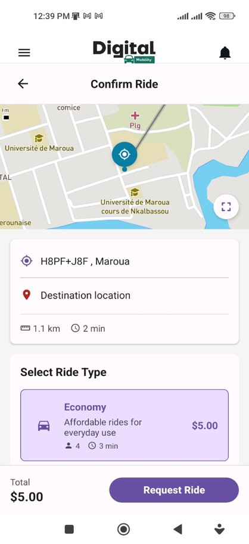
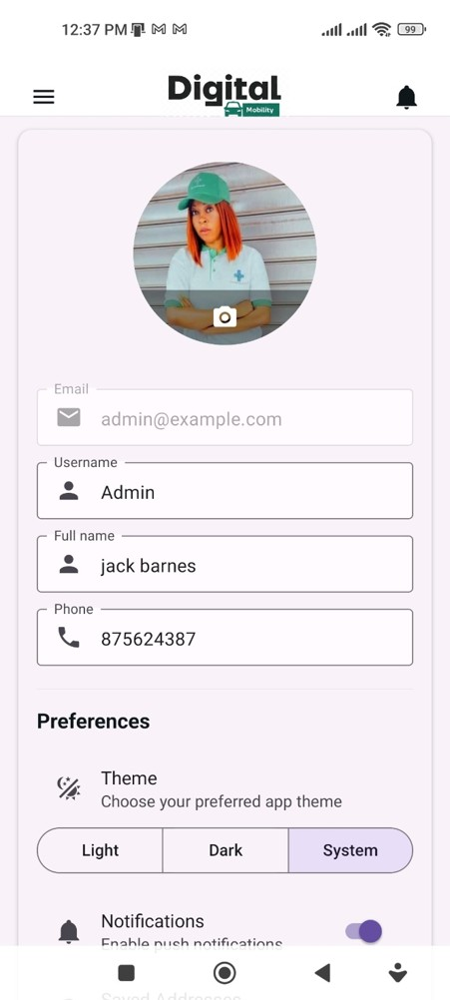

# Digital Mobility Platform

Welcome to the Digital Mobility Platform documentation. A modern, full-featured ride-sharing/taxi application built with Expo and React Native.

## Overview

The Digital Mobility Platform is a comprehensive mobile solution for on-demand transportation. Built with cutting-edge technologies, it delivers a seamless experience for passengers seeking reliable, affordable rides.

- **Platform**: Android, iOS, and Web
- **Framework**: Expo + React Native
- **Backend**: Supabase
- **Maps**: Mapbox GL
- **Language**: TypeScript

## Key Features

### Core Functionality

- **User Authentication** - Secure email/password authentication with Supabase
- **Interactive Maps** - Powered by Mapbox for high-performance mapping
- **Real-Time Tracking** - Track your ride from booking to completion
- **Multiple Vehicle Types** - Economy, Comfort, Premium, and XL options
- **Flexible Payments** - Credit/debit cards, mobile wallets, and cash
- **Ride History** - Complete record of all your trips with receipts
- **Saved Addresses** - Quick access to Home, Work, and favorite locations
- **Safety Features** - Trip sharing, emergency contacts, and 24/7 support

### User Experience

- **Animated Onboarding** - Smooth first-time user experience with 3-slide carousel
- **Dual Themes** - Light and dark mode support
- **Offline Support** - Access history and saved data without internet
- **Push Notifications** - Stay updated on ride status and promotions
- **Multi-Language** - Support for multiple languages

### Technical Highlights

- **Cross-Platform** - Single codebase for Android, iOS, and Web
- **TypeScript** - Type-safe development with strict mode enabled
- **React Query** - Efficient server state management and caching
- **Real-Time Updates** - Live ride tracking and driver location updates
- **Optimized Performance** - Fast load times and smooth animations
- **Secure** - Row-level security and encrypted data storage

## Quick Start

Get started with the Mobility platform in minutes:

### Prerequisites

- Node.js 18 or later
- Expo CLI
- Android Studio (for Android) or Xcode (for iOS)
- Supabase account
- Mapbox account

### Installation

```bash
# Clone the repository
git clone <https://github.com/Bode683/digital-mobility-platform>
cd mobility

# Install dependencies
npm install

# Configure environment variables
cp .env.example .env
# Edit .env with your API keys

# Start development server
npm start
```

[Full Installation Guide →](installation.md)

## Architecture

### Technology Stack

**Frontend**

- **Expo SDK 54** - React Native framework
- **React Native 0.81** - Mobile app framework
- **TypeScript 5.9** - Type-safe JavaScript
- **Expo Router** - File-based routing with typed routes
- **React Query** - Server state management
- **Reanimated** - High-performance animations

**Backend**

- **Supabase** - Backend-as-a-Service
  - PostgreSQL database
  - Real-time subscriptions
  - Authentication
  - Row-level security
- **Mapbox GL** - Maps and location services
  - Interactive maps
  - Geocoding (forward/reverse)
  - Routing and directions

**State Management**

- React Context for global state
- React Query for server state
- AsyncStorage for persistence

**UI Components**

- React Native Paper
- Custom component library
- Material Design icons

### Project Structure

```
mobility/
├── app/                    # Expo Router screens
│   ├── (drawer)/          # Drawer navigation screens
│   │   ├── home.tsx       # Main map/booking screen
│   │   ├── profile.tsx    # User profile
│   │   ├── history.tsx    # Ride history
│   │   └── ...
│   ├── auth.tsx           # Authentication screen
│   ├── onboarding.tsx     # First-time user onboarding
│   └── _layout.tsx        # Root layout
├── src/
│   ├── api/               # API layer (Supabase)
│   ├── components/        # Reusable components
│   ├── features/          # Feature modules
│   │   ├── map/          # Map functionality
│   │   ├── ride-booking/ # Ride booking logic
│   │   ├── payments/     # Payment processing
│   │   └── profile/      # Profile management
│   ├── hooks/            # Custom React hooks
│   ├── lib/              # Utilities and config
│   └── constants/        # App constants and theme
├── assets/               # Images, fonts, etc.
└── app.config.js         # Expo configuration
```

## Use Cases

### For Passengers

1. **Daily Commute** - Regular rides to work, school, or recurring destinations
2. **Airport Transfers** - Reliable transportation to/from airports
3. **Night Out** - Safe rides home after social events
4. **Errands** - Quick trips for shopping, appointments, etc.
5. **Group Travel** - XL vehicles for families or groups

### For Developers

1. **Learning Resource** - Study modern React Native architecture
2. **Base Template** - Start your own ride-sharing app
3. **Integration Example** - Learn Supabase and Mapbox integration
4. **Best Practices** - TypeScript, React Query, and state management patterns

## Platform Comparison

| Feature         | Mobility                       | Traditional Taxi          |
| --------------- | ------------------------------ | ------------------------- |
| **Booking**     | Instant via app                | Phone call or street hail |
| **Pricing**     | Upfront estimate               | Unknown until arrival     |
| **Tracking**    | Real-time GPS                  | No tracking               |
| **Payment**     | Cashless options               | Cash only (usually)       |
| **Driver Info** | Name, photo, rating            | Limited info              |
| **History**     | Complete digital record        | No record                 |
| **Safety**      | Trip sharing, emergency button | Limited safety features   |
| **Feedback**    | Rating system                  | No formal feedback        |

## Documentation Structure

### Getting Started

- **[Installation](installation.md)** - Complete setup guide for development
- **[Configuration](configuration.md)** - Configure environment and services
- **[Features](features.md)** - Comprehensive feature overview

### Using the App

- **[User Guide](user-guide.md)** - How to book rides and use features
- **[Safety](safety.md)** - Safety features and best practices
- **[FAQ](faq.md)** - Frequently asked questions

### Development

- **[API Reference](api-reference.md)** - Complete API documentation
- **[Architecture](architecture.md)** - Technical architecture details
- **[Contributing](contributing.md)** - Contribution guidelines

## Screenshots

### Authentication

<div class="grid" markdown>

{ width="300" }
{ width="300" }

</div>

Secure authentication with email/password. Clean, modern UI with form validation.

### Home Screen & Navigation

<div class="grid" markdown>

{ width="300" }
{ width="300" }

</div>

Interactive Mapbox map showing your location with easy access to all features via the drawer menu.

### Ride Booking Flow

<div class="grid" markdown>

{ width="300" }
{ width="300" }
{ width="300" }

</div>

Choose your vehicle type (Economy, Comfort, Premium, XL), view fare estimates, and confirm your booking.

### Real-Time Tracking

<div class="grid" markdown>

{ width="300" }
{ width="300" }

</div>

Track your driver in real-time from assignment to arrival. View driver details, vehicle info, and ETA.

### Profile & Settings

<div class="grid" markdown>

{ width="300" }
{ width="300" }

</div>

Manage your profile, view ride history, saved addresses, and stay updated with push notifications.

## System Requirements

### For End Users (Mobile App)

**Android**

- Android 8.0 (API level 26) or higher
- 2GB RAM minimum
- GPS enabled
- Internet connection

**iOS**

- iOS 14.0 or higher
- iPhone 6s or newer
- Location Services enabled
- Internet connection

**Web**

- Modern browser (Chrome, Firefox, Safari, Edge)
- JavaScript enabled
- Location permission

### For Developers

**Hardware**

- 8GB RAM minimum (16GB recommended)
- 20GB free disk space
- Multi-core processor

**Software**

- Node.js 18+
- npm or yarn
- Git
- Code editor (VS Code recommended)
- Android Studio and/or Xcode

## Support & Resources

### Documentation

- Browse comprehensive guides and API reference
- Step-by-step tutorials
- Best practices and tips

### Community

- GitHub repository for issues and contributions
- Discussion forums
- Developer chat

### Professional Support

- Email support: support@thinesoft.com
- Priority support for enterprise customers
- Custom development services

[Visit Support Center →](../shared/support.md)

## Roadmap

### Coming Soon

- **Split Payments** - Share ride costs with friends
- **Ride Pooling** - Share rides to save money
- **Recurring Rides** - Schedule daily/weekly trips
- **In-App Chat** - Message drivers directly
- **Multi-Stop Rides** - Add multiple destinations

### Under Development

- **Driver App** - Companion app for drivers
- **Corporate Dashboard** - Business management tools
- **Advanced Analytics** - Detailed usage insights
- **API Integration** - Third-party service integration

## Why Choose Mobility?

### For Users

**Convenience**

- Book rides in seconds
- Track drivers in real-time
- Cashless payments

**Affordability**

- Transparent pricing
- Competitive rates
- No hidden fees

**Safety**

- Verified drivers
- Trip sharing
- 24/7 support

**Reliability**

- Wide coverage
- Quick matching
- Professional drivers

### For Developers

**Modern Stack**

- Latest technologies
- Type-safe development
- Best practices

**Scalable Architecture**

- Modular design
- Reusable components
- Easy to extend

**Well Documented**

- Comprehensive guides
- Code examples
- API reference

**Active Development**

- Regular updates
- Bug fixes
- New features

## Get Started

Ready to experience the future of urban mobility?

<div class="grid cards" markdown>

- **🚀 Install Now**

  ***

  Set up the development environment and start building.

  [Installation Guide →](installation.md)

- **📖 Learn Features**

  ***

  Explore all the features and capabilities.

  [Features Overview →](features.md)

- **👤 User Guide**

  ***

  Learn how to use the app as a passenger.

  [User Guide →](user-guide.md)

- **💻 API Docs**

  ***

  Integrate with the Mobility platform.

  [API Reference →](api-reference.md)

</div>

## License

This project is proprietary software. All rights reserved.

---

**Questions?** Check our [Support](../shared/support.md) page or visit the [FAQ](faq.md).
