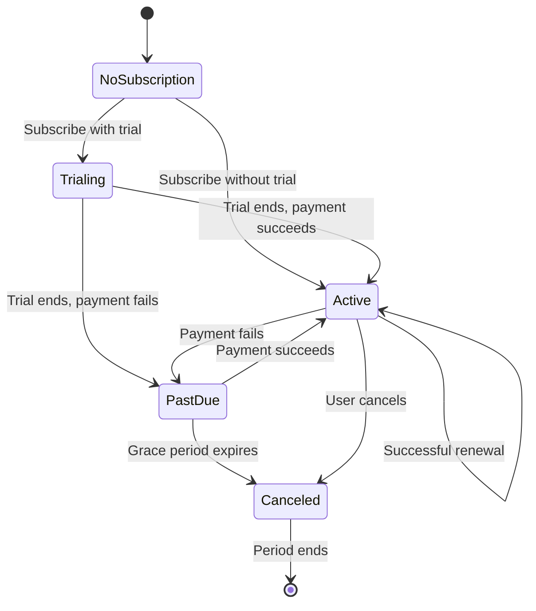

# Subscriptions API

Complete API reference for managing subscriptions and billing in WiWebb.

## Base URL

```
http://localhost:8000/api/v1/subscriptions/
```

## Authentication

All endpoints require authentication:

```
Authorization: Token {your-auth-token}
```

## Permissions

| Role | View All Plans | View Own | Subscribe | Cancel Own | Manage All |
|------|:--------------:|:--------:|:---------:|:----------:|:----------:|
| SuperAdmin | ✅ | ✅ | ✅ | ✅ | ✅ |
| Admin | ✅ | ✅ | ✅ | ✅ | ✅ |
| Tenant Owner | ✅ | ✅ | ✅ | ✅ | ❌ |
| Subscriber | ✅ | ✅ | ✅ | ✅ | ❌ |

## Endpoints Overview

| Endpoint | Method | Description |
|----------|--------|-------------|
| `/subscriptions/plans/` | GET | List available plans |
| `/subscriptions/subscribe/` | POST | Subscribe to a plan |
| `/subscriptions/cancel/` | POST | Cancel subscription |
| `/subscriptions/status/` | GET | Get subscription status |
| `/subscriptions/me/limits/` | GET | Get current user's usage limits |

---

## List Plans

Retrieve available subscription plans with pricing.

### Endpoint

```
GET /api/v1/subscriptions/plans/
```

### Query Parameters

| Parameter | Type | Description |
|-----------|------|-------------|
| available | boolean | Filter by availability (default: true) |
| requires_payment | boolean | Filter by payment requirement |

### Example Requests

=== "cURL"
    ```bash
    # List all available plans
    curl -X GET http://localhost:8000/api/v1/subscriptions/plans/ \
      -H "Authorization: Token {your-token}"

    # Filter free plans
    curl -X GET "http://localhost:8000/api/v1/subscriptions/plans/?requires_payment=false" \
      -H "Authorization: Token {your-token}"
    ```

=== "Python"
    ```python
    import requests

    url = "http://localhost:8000/api/v1/subscriptions/plans/"
    headers = {"Authorization": "Token {your-token}"}

    response = requests.get(url, headers=headers)
    plans = response.json()

    for plan in plans:
        print(f"\n{plan['name']}")
        print(f"  Description: {plan['description']}")
        print(f"  Limits: {plan['daily_time_minutes']}min/day, "
              f"{plan['daily_data_mb']}MB/day")

        if plan['pricing']:
            for price in plan['pricing']:
                print(f"  Price: ${price['amount']}/{price['interval']}")
    ```

=== "JavaScript"
    ```javascript
    const token = localStorage.getItem('auth_token');

    const response = await fetch(
      'http://localhost:8000/api/v1/subscriptions/plans/',
      {
        headers: { 'Authorization': `Token ${token}` }
      }
    );

    const plans = await response.json();

    plans.forEach(plan => {
      console.log(`\n${plan.name}`);
      console.log(`  ${plan.description}`);
      console.log(`  Limits: ${plan.daily_time_minutes}min, ${plan.daily_data_mb}MB`);

      plan.pricing.forEach(price => {
        console.log(`  $${price.amount}/${price.interval}`);
      });
    });
    ```

=== "TypeScript"
    ```typescript
    interface PlanPricing {
      id: number;
      amount: string;
      currency: string;
      interval: 'day' | 'week' | 'month' | 'year';
      trial_period_days: number;
      active: boolean;
      stripe_price_id: string;
    }

    interface Plan {
      id: number;
      name: string;
      description: string;
      default: boolean;
      available: boolean;
      requires_payment: boolean;
      requires_invoice: boolean;
      auto_renew: boolean;
      daily_time_minutes: number | null;
      daily_data_mb: number | null;
      stripe_product_id: string;
      pricing: PlanPricing[];
      created_at: string;
      updated_at: string;
    }

    async function getPlans(): Promise<Plan[]> {
      const token = localStorage.getItem('auth_token');

      const response = await fetch(
        'http://localhost:8000/api/v1/subscriptions/plans/',
        {
          headers: { 'Authorization': `Token ${token}` }
        }
      );

      if (!response.ok) {
        throw new Error('Failed to fetch plans');
      }

      return response.json();
    }

    // Usage
    const plans = await getPlans();
    console.log(`Found ${plans.length} plans`);
    ```

### Success Response

**Code:** `200 OK`

```json
[
  {
    "id": 1,
    "name": "Free",
    "description": "Basic plan for individual users",
    "default": true,
    "available": true,
    "requires_payment": false,
    "requires_invoice": false,
    "auto_renew": false,
    "daily_time_minutes": 60,
    "daily_data_mb": 100,
    "stripe_product_id": "",
    "pricing": [],
    "created_at": "2025-01-01T00:00:00Z",
    "updated_at": "2025-01-01T00:00:00Z"
  },
  {
    "id": 2,
    "name": "Professional",
    "description": "For professionals and small teams",
    "default": false,
    "available": true,
    "requires_payment": true,
    "requires_invoice": false,
    "auto_renew": true,
    "daily_time_minutes": 480,
    "daily_data_mb": 2048,
    "stripe_product_id": "prod_ABC123",
    "pricing": [
      {
        "id": 1,
        "amount": "19.99",
        "currency": "USD",
        "interval": "month",
        "trial_period_days": 14,
        "active": true,
        "stripe_price_id": "price_XYZ789"
      },
      {
        "id": 2,
        "amount": "199.99",
        "currency": "USD",
        "interval": "year",
        "trial_period_days": 14,
        "active": true,
        "stripe_price_id": "price_ABC456"
      }
    ],
    "created_at": "2025-01-01T00:00:00Z",
    "updated_at": "2025-11-01T00:00:00Z"
  },
  {
    "id": 3,
    "name": "Enterprise",
    "description": "Unlimited access for large organizations",
    "default": false,
    "available": true,
    "requires_payment": true,
    "requires_invoice": true,
    "auto_renew": true,
    "daily_time_minutes": null,
    "daily_data_mb": null,
    "stripe_product_id": "prod_DEF456",
    "pricing": [
      {
        "id": 3,
        "amount": "99.99",
        "currency": "USD",
        "interval": "month",
        "trial_period_days": 30,
        "active": true,
        "stripe_price_id": "price_ENT123"
      }
    ],
    "created_at": "2025-01-01T00:00:00Z",
    "updated_at": "2025-11-01T00:00:00Z"
  }
]
```

---

## Subscribe to Plan

Subscribe a user to a plan.

### Endpoint

```
POST /api/v1/subscriptions/subscribe/
```

### Request Body

| Field | Type | Required | Description |
|-------|------|----------|-------------|
| plan_id | integer | ✅ | ID of the plan to subscribe to |
| pricing_id | integer | ❌ | Specific pricing option (if plan has multiple) |

!!! info "Payment Flow"
    - **Free plans**: Subscription is activated immediately
    - **Paid plans**: Returns Stripe checkout URL or payment intent

### Example Requests

=== "cURL"
    ```bash
    curl -X POST http://localhost:8000/api/v1/subscriptions/subscribe/ \
      -H "Authorization: Token {your-token}" \
      -H "Content-Type: application/json" \
      -d '{
        "plan_id": 2
      }'
    ```

=== "Python"
    ```python
    import requests

    url = "http://localhost:8000/api/v1/subscriptions/subscribe/"
    headers = {
        "Authorization": "Token {your-token}",
        "Content-Type": "application/json"
    }

    # Subscribe to plan
    response = requests.post(
        url,
        headers=headers,
        json={"plan_id": 2}
    )

    result = response.json()

    if 'checkout_url' in result:
        print(f"Complete payment at: {result['checkout_url']}")
    elif 'subscription_id' in result:
        print(f"Subscribed! ID: {result['subscription_id']}")
    ```

=== "JavaScript"
    ```javascript
    const token = localStorage.getItem('auth_token');

    const response = await fetch(
      'http://localhost:8000/api/v1/subscriptions/subscribe/',
      {
        method: 'POST',
        headers: {
          'Authorization': `Token ${token}`,
          'Content-Type': 'application/json'
        },
        body: JSON.stringify({
          plan_id: 2
        })
      }
    );

    const result = await response.json();

    if (result.checkout_url) {
      // Redirect to Stripe checkout
      window.location.href = result.checkout_url;
    } else if (result.subscription_id) {
      console.log('Subscribed successfully!');
    }
    ```

=== "TypeScript"
    ```typescript
    interface SubscribeRequest {
      plan_id: number;
      pricing_id?: number;
    }

    interface SubscribeResponse {
      subscription_id?: string;
      status?: string;
      checkout_url?: string;
      client_secret?: string;
      plan: {
        id: number;
        name: string;
      };
    }

    async function subscribeToPlan(
      planId: number,
      pricingId?: number
    ): Promise<SubscribeResponse> {
      const token = localStorage.getItem('auth_token');

      const response = await fetch(
        'http://localhost:8000/api/v1/subscriptions/subscribe/',
        {
          method: 'POST',
          headers: {
            'Authorization': `Token ${token}`,
            'Content-Type': 'application/json'
          },
          body: JSON.stringify({
            plan_id: planId,
            ...(pricingId && { pricing_id: pricingId })
          })
        }
      );

      if (!response.ok) {
        const error = await response.json();
        throw new Error(error.error || 'Subscription failed');
      }

      return response.json();
    }

    // Usage
    try {
      const result = await subscribeToPlan(2);

      if (result.checkout_url) {
        window.location.href = result.checkout_url;
      } else {
        console.log('Subscribed:', result.subscription_id);
      }
    } catch (error) {
      console.error('Error:', error.message);
    }
    ```

### Success Response (Free Plan)

**Code:** `200 OK`

```json
{
  "subscription_id": "sub_local_123",
  "status": "active",
  "plan": {
    "id": 1,
    "name": "Free"
  },
  "current_period_end": null,
  "trial_end": null
}
```

### Success Response (Paid Plan - Stripe Checkout)

**Code:** `200 OK`

```json
{
  "checkout_url": "https://checkout.stripe.com/pay/cs_test_abc123...",
  "plan": {
    "id": 2,
    "name": "Professional"
  }
}
```

### Success Response (Paid Plan - Payment Intent)

**Code:** `200 OK`

```json
{
  "client_secret": "pi_abc123_secret_def456",
  "subscription_id": "sub_ABC123XYZ",
  "status": "incomplete",
  "plan": {
    "id": 2,
    "name": "Professional"
  }
}
```

### Error Responses

**Code:** `400 Bad Request` (Plan not available)

```json
{
  "error": "Plan not available"
}
```

**Code:** `400 Bad Request` (Already subscribed)

```json
{
  "error": "User already has an active subscription"
}
```

**Code:** `400 Bad Request` (No pricing)

```json
{
  "error": "Plan pricing unavailable"
}
```

---

## Cancel Subscription

Cancel the current user's active subscription.

### Endpoint

```
POST /api/v1/subscriptions/cancel/
```

### Request Body

No request body required.

### Example Requests

=== "cURL"
    ```bash
    curl -X POST http://localhost:8000/api/v1/subscriptions/cancel/ \
      -H "Authorization: Token {your-token}"
    ```

=== "Python"
    ```python
    import requests

    url = "http://localhost:8000/api/v1/subscriptions/cancel/"
    headers = {"Authorization": "Token {your-token}"}

    response = requests.post(url, headers=headers)
    result = response.json()

    print(result['message'])
    print(f"Status: {result['subscription']['status']}")
    ```

=== "JavaScript"
    ```javascript
    const token = localStorage.getItem('auth_token');

    const response = await fetch(
      'http://localhost:8000/api/v1/subscriptions/cancel/',
      {
        method: 'POST',
        headers: { 'Authorization': `Token ${token}` }
      }
    );

    const result = await response.json();
    console.log(result.message);
    ```

### Success Response

**Code:** `200 OK`

```json
{
  "message": "Subscription cancelled successfully",
  "subscription": {
    "id": "sub_ABC123",
    "status": "canceled",
    "canceled_at": "2025-11-30T16:30:00Z",
    "current_period_end": "2025-12-30T16:30:00Z"
  }
}
```

!!! info "Access After Cancellation"
    Users retain access until the end of the current billing period.

### Error Response

**Code:** `400 Bad Request` (No active subscription)

```json
{
  "error": "No active subscription found"
}
```

---

## Get Subscription Status

Retrieve the current user's subscription status.

### Endpoint

```
GET /api/v1/subscriptions/status/
```

### Example Requests

=== "cURL"
    ```bash
    curl -X GET http://localhost:8000/api/v1/subscriptions/status/ \
      -H "Authorization: Token {your-token}"
    ```

=== "Python"
    ```python
    import requests

    url = "http://localhost:8000/api/v1/subscriptions/status/"
    headers = {"Authorization": "Token {your-token}"}

    response = requests.get(url, headers=headers)
    status = response.json()

    print(f"Plan: {status['plan']['name']}")
    print(f"Status: {status['status']}")

    if status['current_period_end']:
        print(f"Renews: {status['current_period_end']}")
    ```

=== "JavaScript"
    ```javascript
    const token = localStorage.getItem('auth_token');

    const response = await fetch(
      'http://localhost:8000/api/v1/subscriptions/status/',
      {
        headers: { 'Authorization': `Token ${token}` }
      }
    );

    const status = await response.json();
    console.log('Subscription status:', status);
    ```

### Success Response

**Code:** `200 OK`

```json
{
  "subscription_id": "sub_ABC123",
  "status": "active",
  "plan": {
    "id": 2,
    "name": "Professional",
    "description": "For professionals and small teams"
  },
  "current_period_start": "2025-11-01T00:00:00Z",
  "current_period_end": "2025-12-01T00:00:00Z",
  "trial_end": null,
  "cancel_at_period_end": false,
  "canceled_at": null
}
```

**Status Values:**
- `active` - Subscription is active
- `trialing` - In trial period
- `past_due` - Payment failed, grace period
- `canceled` - Cancelled, access until period end
- `incomplete` - Payment pending

### Error Response

**Code:** `404 Not Found` (No subscription)

```json
{
  "error": "No subscription found"
}
```

---

## Get Usage Limits

Retrieve the current user's usage limits based on their plan.

### Endpoint

```
GET /api/v1/subscriptions/me/limits/
```

### Example Requests

=== "cURL"
    ```bash
    curl -X GET http://localhost:8000/api/v1/subscriptions/me/limits/ \
      -H "Authorization: Token {your-token}"
    ```

=== "Python"
    ```python
    import requests

    url = "http://localhost:8000/api/v1/subscriptions/me/limits/"
    headers = {"Authorization": "Token {your-token}"}

    response = requests.get(url, headers=headers)
    limits = response.json()

    print(f"Daily time limit: {limits['daily_time_minutes']} minutes")
    print(f"Daily data limit: {limits['daily_data_mb']} MB")
    print(f"Current usage:")
    print(f"  Time: {limits['usage']['time_used_minutes']} min")
    print(f"  Data: {limits['usage']['data_used_mb']} MB")
    ```

=== "JavaScript"
    ```javascript
    const token = localStorage.getItem('auth_token');

    const response = await fetch(
      'http://localhost:8000/api/v1/subscriptions/me/limits/',
      {
        headers: { 'Authorization': `Token ${token}` }
      }
    );

    const limits = await response.json();

    console.log('Limits:', limits);
    console.log(`Time: ${limits.usage.time_used_minutes}/${limits.daily_time_minutes} min`);
    console.log(`Data: ${limits.usage.data_used_mb}/${limits.daily_data_mb} MB`);
    ```

### Success Response

**Code:** `200 OK`

```json
{
  "plan": {
    "id": 2,
    "name": "Professional"
  },
  "daily_time_minutes": 480,
  "daily_data_mb": 2048,
  "usage": {
    "time_used_minutes": 125,
    "data_used_mb": 456,
    "time_remaining_minutes": 355,
    "data_remaining_mb": 1592,
    "reset_at": "2025-12-01T00:00:00Z"
  }
}
```

!!! info "Unlimited Plans"
    For unlimited plans, `daily_time_minutes` and `daily_data_mb` will be `null`.

---

## Subscription Lifecycle

### Subscription Flow Diagram



## Code Examples

### Complete Subscription Flow

=== "Python"
    ```python
    import requests

    class SubscriptionClient:
        def __init__(self, token):
            self.base_url = "http://localhost:8000/api/v1/subscriptions"
            self.headers = {
                "Authorization": f"Token {token}",
                "Content-Type": "application/json"
            }

        def get_plans(self):
            """Get all available plans."""
            response = requests.get(
                f"{self.base_url}/plans/",
                headers=self.headers
            )
            return response.json()

        def subscribe(self, plan_id):
            """Subscribe to a plan."""
            response = requests.post(
                f"{self.base_url}/subscribe/",
                headers=self.headers,
                json={"plan_id": plan_id}
            )
            return response.json()

        def get_status(self):
            """Get current subscription status."""
            response = requests.get(
                f"{self.base_url}/status/",
                headers=self.headers
            )
            return response.json()

        def get_limits(self):
            """Get usage limits."""
            response = requests.get(
                f"{self.base_url}/me/limits/",
                headers=self.headers
            )
            return response.json()

        def cancel(self):
            """Cancel subscription."""
            response = requests.post(
                f"{self.base_url}/cancel/",
                headers=self.headers
            )
            return response.json()

    # Usage
    client = SubscriptionClient("{your-token}")

    # 1. Browse plans
    plans = client.get_plans()
    for plan in plans:
        print(f"{plan['name']}: ${plan['pricing'][0]['amount']}/month")

    # 2. Subscribe
    result = client.subscribe(plan_id=2)
    if 'checkout_url' in result:
        print(f"Complete payment: {result['checkout_url']}")

    # 3. Check status
    status = client.get_status()
    print(f"Status: {status['status']}")

    # 4. Check limits
    limits = client.get_limits()
    print(f"Usage: {limits['usage']['time_used_minutes']} min")

    # 5. Cancel (if needed)
    # cancel_result = client.cancel()
    ```

=== "TypeScript"
    ```typescript
    class SubscriptionAPI {
      private baseUrl = 'http://localhost:8000/api/v1/subscriptions';
      private token: string;

      constructor(token: string) {
        this.token = token;
      }

      private async request(endpoint: string, options?: RequestInit) {
        const response = await fetch(`${this.baseUrl}${endpoint}`, {
          ...options,
          headers: {
            'Authorization': `Token ${this.token}`,
            'Content-Type': 'application/json',
            ...options?.headers
          }
        });

        if (!response.ok) {
          const error = await response.json();
          throw new Error(error.error || 'Request failed');
        }

        return response.json();
      }

      async getPlans() {
        return this.request('/plans/');
      }

      async subscribe(planId: number) {
        return this.request('/subscribe/', {
          method: 'POST',
          body: JSON.stringify({ plan_id: planId })
        });
      }

      async getStatus() {
        return this.request('/status/');
      }

      async getLimits() {
        return this.request('/me/limits/');
      }

      async cancel() {
        return this.request('/cancel/', { method: 'POST' });
      }
    }

    // Usage
    const api = new SubscriptionAPI(localStorage.getItem('auth_token')!);

    // Browse plans
    const plans = await api.getPlans();

    // Subscribe
    const result = await api.subscribe(2);
    if (result.checkout_url) {
      window.location.href = result.checkout_url;
    }

    // Check status
    const status = await api.getStatus();
    console.log(`Plan: ${status.plan.name}, Status: ${status.status}`);

    // Check limits
    const limits = await api.getLimits();
    console.log(`Usage: ${limits.usage.time_used_minutes}/${limits.daily_time_minutes} min`);
    ```

### Plan Comparison Component

=== "React"
    ```tsx
    import { useState, useEffect } from 'react';

    function PlanComparison() {
      const [plans, setPlans] = useState([]);
      const [loading, setLoading] = useState(true);

      useEffect(() => {
        const fetchPlans = async () => {
          const token = localStorage.getItem('auth_token');
          const response = await fetch(
            'http://localhost:8000/api/v1/subscriptions/plans/',
            {
              headers: { 'Authorization': `Token ${token}` }
            }
          );
          const data = await response.json();
          setPlans(data);
          setLoading(false);
        };

        fetchPlans();
      }, []);

      const handleSubscribe = async (planId) => {
        const token = localStorage.getItem('auth_token');
        const response = await fetch(
          'http://localhost:8000/api/v1/subscriptions/subscribe/',
          {
            method: 'POST',
            headers: {
              'Authorization': `Token ${token}`,
              'Content-Type': 'application/json'
            },
            body: JSON.stringify({ plan_id: planId })
          }
        );

        const result = await response.json();

        if (result.checkout_url) {
          window.location.href = result.checkout_url;
        } else {
          alert('Subscribed successfully!');
        }
      };

      if (loading) return <div>Loading plans...</div>;

      return (
        <div className="plan-grid">
          {plans.map(plan => (
            <div key={plan.id} className="plan-card">
              <h3>{plan.name}</h3>
              <p>{plan.description}</p>

              <div className="limits">
                <p>
                  {plan.daily_time_minutes
                    ? `${plan.daily_time_minutes} min/day`
                    : 'Unlimited time'}
                </p>
                <p>
                  {plan.daily_data_mb
                    ? `${plan.daily_data_mb} MB/day`
                    : 'Unlimited data'}
                </p>
              </div>

              {plan.pricing.length > 0 && (
                <div className="pricing">
                  <span className="price">
                    ${plan.pricing[0].amount}
                  </span>
                  <span className="interval">
                    /{plan.pricing[0].interval}
                  </span>
                </div>
              )}

              <button onClick={() => handleSubscribe(plan.id)}>
                Subscribe
              </button>
            </div>
          ))}
        </div>
      );
    }

    export default PlanComparison;
    ```

## Webhook Events

For handling Stripe webhooks, see the [Payments API](payments.md#webhooks) documentation.

## Next Steps

- **[Payments API](payments.md)** - Payment processing and webhooks
- **[Authentication API](authentication.md)** - User authentication
- **[User Guide](../user-guide/billing/plans.md)** - Managing subscriptions in the UI

---

!!! question "Need Help?"
    For API questions, check the [FAQ](../troubleshooting/faq.md) or contact dev@thinesoft.com
