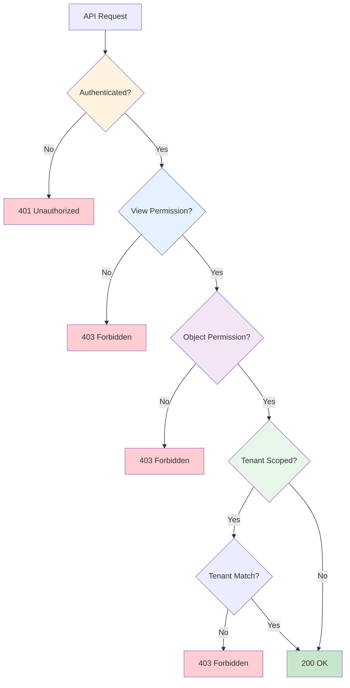

# Backend Architecture

This document details WiWebb's Django backend architecture, including app structure, models, APIs, and design patterns.

## Django Project Structure

WiWebb's backend follows Django's recommended project layout with a clear separation of concerns:

```
backend/
├── manage.py                    # Django CLI
├── backend/                     # Project settings
│   ├── __init__.py
│   ├── settings.py             # Django configuration
│   ├── urls.py                 # Root URL configuration
│   ├── wsgi.py                 # WSGI entry point
│   └── asgi.py                 # ASGI entry point
├── api/                        # Core API app
│   ├── models.py              # User, Tenant, Todo, AuditLog
│   ├── views.py               # API viewsets
│   ├── serializers.py         # Data serialization
│   ├── permissions.py         # Custom permissions
│   ├── urls.py                # API routes
│   ├── admin.py               # Django admin config
│   └── migrations/            # Database migrations
├── payment_gateway/           # Payment & subscriptions
│   ├── models.py             # Payment, Plan, Subscription
│   ├── views.py              # Payment API viewsets
│   ├── serializers.py        # Payment serializers
│   ├── stripe_service.py     # Stripe integration
│   └── migrations/
└── requirements.txt          # Python dependencies
```

## Django Apps

WiWebb is organized into focused Django apps, each with a specific responsibility:

### api App

**Purpose:** Core user and tenant management

**Models:**
- `Tenant` - Organization/customer entities
- `User` - Custom user model with roles
- `Todo` - Simple task management (demo feature)
- `AuditLog` - Audit trail for sensitive actions

**Responsibilities:**
- User authentication and authorization
- Multi-tenant management
- Role-based access control
- Audit logging

### payment_gateway App

**Purpose:** Billing and subscription management

**Models:**
- `PaymentGatewayConfig` - Payment gateway configuration
- `Payment` - Payment transactions
- `PaymentLog` - Payment event logging
- `Plan` - Subscription plans
- `PlanPricing` - Plan pricing tiers

**Responsibilities:**
- Stripe integration
- Subscription management
- Payment processing
- Webhook handling

## Data Models Deep Dive

### User Model

The custom User model extends Django's `AbstractUser` with multi-tenancy and role support:

```python title="api/models.py" linenums="1" hl_lines="7-11 14-19"
from django.contrib.auth.models import AbstractUser
from django.db import models

class User(AbstractUser):
    """Custom user model with role-based permissions and tenant association."""

    class Roles(models.TextChoices):  # (1)!
        SUPERADMIN = "superadmin", "SuperAdmin"
        ADMIN = "admin", "Admin"
        TENANT_OWNER = "tenant_owner", "Tenant Owner"
        SUBSCRIBER = "subscriber", "Subscriber"

    role = models.CharField(
        max_length=20,
        choices=Roles.choices,
        default=Roles.SUBSCRIBER,
        db_index=True,  # (2)!
        help_text="Application role for permissions",
    )

    tenant = models.ForeignKey(
        Tenant,
        null=True,
        blank=True,
        on_delete=models.PROTECT,
        related_name="users",
        db_index=True,  # (3)!
    )

    # Additional fields
    phone_number = models.CharField(max_length=20, blank=True)
    bio = models.TextField(blank=True)
    url = models.URLField(blank=True)
    company = models.CharField(max_length=100, blank=True)
    location = models.CharField(max_length=100, blank=True)
    birth_date = models.DateField(null=True, blank=True)
    password_updated = models.DateTimeField(auto_now=True)

    @property
    def is_staff(self):
        """Staff status derived from role."""
        return self.role in [self.Roles.SUPERADMIN, self.Roles.ADMIN]

    @property
    def is_superuser(self):
        """Superuser status derived from role."""
        return self.role == self.Roles.SUPERADMIN

    class Meta:
        ordering = ("username",)
        indexes = [
            models.Index(fields=["role", "tenant"]),  # (4)!
        ]
```

1. Enum-style choices for type safety
2. Indexed for fast permission checks
3. Indexed for tenant filtering
4. Composite index for common query pattern

**Key Design Decisions:**

!!! info "Role-Derived Permissions"
    `is_staff` and `is_superuser` are computed properties, not database fields.
    The `role` field is the single source of truth for permissions.

!!! tip "Why PROTECT on Tenant?"
    Using `on_delete=models.PROTECT` prevents accidental tenant deletion if users still exist.

### Tenant Model

```python title="api/models.py"
class Tenant(models.Model):
    """Represents an organization in the multi-tenant system."""

    name = models.CharField(max_length=150, unique=True)
    is_active = models.BooleanField(default=True)
    slug = models.SlugField(
        max_length=160,
        unique=True,
        db_index=True  # (1)!
    )
    description = models.TextField(blank=True)
    email = models.EmailField(blank=True, null=True)
    url = models.URLField(blank=True, null=True)
    uuid = models.UUIDField(
        default=uuid.uuid4,
        unique=True,
        editable=False
    )
    created_at = models.DateTimeField(auto_now_add=True)
    updated_at = models.DateTimeField(auto_now=True)

    class Meta:
        ordering = ("name",)

    def __str__(self):
        return self.name
```

1. Slug is indexed for fast lookups in URLs

### Payment Models

```python title="payment_gateway/models.py"
class Plan(models.Model):
    """Subscription plan definition."""

    name = models.CharField(max_length=100, unique=True)
    description = models.TextField(blank=True)

    # Availability flags
    default = models.BooleanField(default=False)
    available = models.BooleanField(default=True)

    # Payment requirements
    requires_payment = models.BooleanField(default=True)
    requires_invoice = models.BooleanField(default=False)
    auto_renew = models.BooleanField(default=True)

    # Usage limits (policy enforcement)
    daily_time_minutes = models.IntegerField(
        null=True,
        blank=True,
        help_text="Daily connection time limit in minutes"
    )
    daily_data_mb = models.IntegerField(
        null=True,
        blank=True,
        help_text="Daily data transfer limit in MB"
    )

    # Stripe integration
    stripe_product_id = models.CharField(
        max_length=255,
        blank=True,
        help_text="Stripe Product ID"
    )

    metadata = models.JSONField(default=dict, blank=True)
    created_at = models.DateTimeField(auto_now_add=True)
    updated_at = models.DateTimeField(auto_now=True)


class PlanPricing(models.Model):
    """Pricing configuration for a plan."""

    plan = models.ForeignKey(
        Plan,
        on_delete=models.CASCADE,
        related_name="pricing"
    )
    amount = models.DecimalField(max_digits=10, decimal_places=2)
    currency = models.CharField(max_length=3, default="USD")

    class BillingInterval(models.TextChoices):
        DAY = "day", "Daily"
        WEEK = "week", "Weekly"
        MONTH = "month", "Monthly"
        YEAR = "year", "Yearly"

    interval = models.CharField(
        max_length=10,
        choices=BillingInterval.choices,
        default=BillingInterval.MONTH
    )
    trial_period_days = models.IntegerField(default=0)
    active = models.BooleanField(default=True)
    stripe_price_id = models.CharField(max_length=255, blank=True)
```

### AuditLog Model

```python title="api/models.py"
class AuditLog(models.Model):
    """Audit trail for sensitive user/tenant actions."""

    class Actions(models.TextChoices):
        ROLE_CHANGED = "role_changed", "Role Changed"
        PASSWORD_RESET = "password_reset", "Password Reset"
        ACTIVATION_CHANGED = "activation_changed", "Activation Changed"

    actor = models.ForeignKey(
        User,
        on_delete=models.SET_NULL,
        null=True,
        related_name="actions_performed"
    )
    target = models.ForeignKey(
        User,
        on_delete=models.SET_NULL,
        null=True,
        related_name="actions_received"
    )
    action = models.CharField(max_length=50, choices=Actions.choices)
    details = models.JSONField(default=dict)
    timestamp = models.DateTimeField(auto_now_add=True)

    class Meta:
        ordering = ("-timestamp",)
```

## API Architecture

### ViewSets

WiWebb uses Django REST Framework's ViewSets for clean, RESTful APIs:

```python title="api/views.py"
from rest_framework import viewsets, permissions
from rest_framework.decorators import action
from rest_framework.response import Response

class TenantViewSet(viewsets.ModelViewSet):
    """
    ViewSet for Tenant management.

    Permissions:
    - SuperAdmin/Admin: Can manage all tenants
    - TenantOwner: Can view/edit own tenant only
    - Subscriber: No access
    """
    serializer_class = TenantSerializer
    permission_classes = [permissions.IsAuthenticated]

    def get_queryset(self):
        """Apply tenant-scoped filtering."""
        user = self.request.user

        if user.role in ["superadmin", "admin"]:
            # SuperAdmins and Admins see all tenants
            return Tenant.objects.all()
        elif user.role == "tenant_owner":
            # Tenant Owners see only their tenant
            return Tenant.objects.filter(id=user.tenant_id)
        else:
            # Subscribers have no access
            return Tenant.objects.none()

    @action(detail=False, methods=["get"])
    def me(self, request):
        """Get current user's tenant."""
        if request.user.tenant:
            serializer = self.get_serializer(request.user.tenant)
            return Response(serializer.data)
        return Response({"detail": "No tenant assigned"}, status=404)
```

### Serializers

Serializers handle data transformation and validation:

```python title="api/serializers.py"
from rest_framework import serializers
from .models import User, Tenant

class TenantSerializer(serializers.ModelSerializer):
    """Serializer for Tenant model."""

    user_count = serializers.SerializerMethodField()

    class Meta:
        model = Tenant
        fields = [
            'id', 'name', 'slug', 'email', 'url',
            'description', 'is_active', 'uuid',
            'created_at', 'updated_at', 'user_count'
        ]
        read_only_fields = ['uuid', 'created_at', 'updated_at']

    def get_user_count(self, obj):
        """Count users in this tenant."""
        return obj.users.count()


class UserSerializer(serializers.ModelSerializer):
    """Serializer for User model."""

    tenant_name = serializers.CharField(
        source='tenant.name',
        read_only=True
    )

    class Meta:
        model = User
        fields = [
            'id', 'username', 'email', 'first_name', 'last_name',
            'role', 'tenant', 'tenant_name', 'is_active',
            'phone_number', 'bio', 'url', 'company', 'location',
            'date_joined', 'last_login'
        ]
        read_only_fields = ['date_joined', 'last_login']
        extra_kwargs = {
            'password': {'write_only': True}
        }

    def create(self, validated_data):
        """Create user with hashed password."""
        password = validated_data.pop('password', None)
        user = User(**validated_data)
        if password:
            user.set_password(password)
        user.save()
        return user
```

## Permission System

### Custom Permissions

```python title="api/permissions.py"
from rest_framework import permissions

class IsSuperAdminOrAdmin(permissions.BasePermission):
    """Allow access only to SuperAdmins and Admins."""

    def has_permission(self, request, view):
        return (
            request.user.is_authenticated and
            request.user.role in ["superadmin", "admin"]
        )


class IsTenantOwnerOrAdmin(permissions.BasePermission):
    """Allow tenant owners to manage their own resources."""

    def has_permission(self, request, view):
        return request.user.is_authenticated

    def has_object_permission(self, request, view, obj):
        user = request.user

        # SuperAdmin and Admin can access anything
        if user.role in ["superadmin", "admin"]:
            return True

        # Tenant Owner can only access own tenant's resources
        if user.role == "tenant_owner":
            # Check if object belongs to user's tenant
            if hasattr(obj, 'tenant'):
                return obj.tenant_id == user.tenant_id
            return False

        return False
```

### Permission Flow



## URL Configuration

### Root URLs

```python title="backend/urls.py"
from django.contrib import admin
from django.urls import path, include

urlpatterns = [
    path('admin/', admin.site.urls),
    path('api/v1/', include('api.urls')),
    path('api/v1/payments/', include('payment_gateway.urls')),
    path('api/v1/auth/', include('dj_rest_auth.urls')),
    path('api/v1/auth/registration/', include('dj_rest_auth.registration.urls')),
]
```

### API URLs

```python title="api/urls.py"
from django.urls import path, include
from rest_framework.routers import DefaultRouter
from .views import TenantViewSet, UserViewSet, TodoViewSet

router = DefaultRouter()
router.register(r'tenants', TenantViewSet, basename='tenant')
router.register(r'users', UserViewSet, basename='user')
router.register(r'todos', TodoViewSet, basename='todo')

urlpatterns = [
    path('', include(router.urls)),
]
```

## Stripe Integration

### Stripe Service

```python title="payment_gateway/stripe_service.py"
import stripe
from django.conf import settings

stripe.api_key = settings.STRIPE_SECRET_KEY

class StripeService:
    """Service class for Stripe operations."""

    @staticmethod
    def create_customer(user):
        """Create a Stripe customer for a user."""
        customer = stripe.Customer.create(
            email=user.email,
            name=f"{user.first_name} {user.last_name}",
            metadata={
                'user_id': user.id,
                'tenant_id': user.tenant_id if user.tenant else None
            }
        )
        return customer

    @staticmethod
    def create_subscription(customer_id, price_id):
        """Create a subscription for a customer."""
        subscription = stripe.Subscription.create(
            customer=customer_id,
            items=[{'price': price_id}],
            payment_behavior='default_incomplete',
            expand=['latest_invoice.payment_intent']
        )
        return subscription

    @staticmethod
    def cancel_subscription(subscription_id):
        """Cancel a subscription."""
        subscription = stripe.Subscription.delete(subscription_id)
        return subscription
```

### Webhook Handling

```python title="payment_gateway/views.py"
from django.views.decorators.csrf import csrf_exempt
from django.http import HttpResponse
import stripe

@csrf_exempt
def stripe_webhook(request):
    """Handle Stripe webhook events."""
    payload = request.body
    sig_header = request.META.get('HTTP_STRIPE_SIGNATURE')

    try:
        event = stripe.Webhook.construct_event(
            payload, sig_header, settings.STRIPE_WEBHOOK_SECRET
        )
    except ValueError:
        return HttpResponse(status=400)
    except stripe.error.SignatureVerificationError:
        return HttpResponse(status=400)

    # Handle specific events
    if event['type'] == 'payment_intent.succeeded':
        handle_payment_succeeded(event['data']['object'])
    elif event['type'] == 'payment_intent.payment_failed':
        handle_payment_failed(event['data']['object'])
    elif event['type'] == 'customer.subscription.created':
        handle_subscription_created(event['data']['object'])

    return HttpResponse(status=200)
```

## Database Optimization

### Indexing Strategy

```python
# Strategic indexes for performance
class User(AbstractUser):
    role = models.CharField(db_index=True)  # Permission checks
    tenant = models.ForeignKey(db_index=True)  # Filtering

    class Meta:
        indexes = [
            models.Index(fields=['role', 'tenant']),  # Composite
            models.Index(fields=['email']),  # Lookups
        ]
```

### Query Optimization

```python
# Use select_related for foreign keys
users = User.objects.select_related('tenant').all()

# Use prefetch_related for reverse relations
tenants = Tenant.objects.prefetch_related('users').all()

# Only fetch needed fields
users = User.objects.only('id', 'username', 'email')

# Aggregate queries
from django.db.models import Count
tenant_stats = Tenant.objects.annotate(
    user_count=Count('users')
)
```

## Middleware

### Custom Middleware

```python title="api/middleware.py"
class TenantMiddleware:
    """Middleware to set current tenant context."""

    def __init__(self, get_response):
        self.get_response = get_response

    def __call__(self, request):
        if request.user.is_authenticated and request.user.tenant:
            # Store tenant in thread-local storage
            request.current_tenant = request.user.tenant

        response = self.get_response(request)
        return response
```

## Error Handling

### Custom Exception Handler

```python title="api/exceptions.py"
from rest_framework.views import exception_handler
from rest_framework.response import Response

def custom_exception_handler(exc, context):
    """Custom exception handler for consistent error responses."""
    response = exception_handler(exc, context)

    if response is not None:
        custom_response = {
            'error': True,
            'message': str(exc),
            'status_code': response.status_code,
            'details': response.data
        }
        response.data = custom_response

    return response
```

## Testing

### Model Tests

```python title="api/tests/test_models.py"
from django.test import TestCase
from api.models import Tenant, User

class TenantModelTest(TestCase):
    def setUp(self):
        self.tenant = Tenant.objects.create(
            name="Test Tenant",
            slug="test-tenant"
        )

    def test_tenant_creation(self):
        self.assertEqual(self.tenant.name, "Test Tenant")
        self.assertTrue(self.tenant.is_active)
        self.assertIsNotNone(self.tenant.uuid)
```

### API Tests

```python title="api/tests/test_views.py"
from rest_framework.test import APITestCase
from rest_framework import status
from api.models import User, Tenant

class TenantAPITest(APITestCase):
    def setUp(self):
        self.user = User.objects.create_user(
            username='admin',
            password='password',
            role=User.Roles.SUPERADMIN
        )
        self.client.force_authenticate(user=self.user)

    def test_create_tenant(self):
        data = {
            'name': 'New Tenant',
            'slug': 'new-tenant',
            'email': 'tenant@example.com'
        }
        response = self.client.post('/api/v1/tenants/', data)
        self.assertEqual(response.status_code, status.HTTP_201_CREATED)
```

## Best Practices

!!! tip "Backend Development Best Practices"
    1. **Fat Models, Thin Views** - Keep business logic in models
    2. **Use Serializers** - Never expose models directly
    3. **Index Strategically** - Index fields used in filters and joins
    4. **Validate Input** - Use serializer validation
    5. **Handle Errors** - Provide meaningful error messages
    6. **Test Thoroughly** - Write tests for models, views, and serializers
    7. **Document APIs** - Use docstrings and API documentation tools
    8. **Optimize Queries** - Use select_related and prefetch_related
    9. **Secure by Default** - Require authentication, validate permissions
    10. **Log Important Events** - Use AuditLog for sensitive actions

## Next Steps

Explore related architecture topics:

- **[Database Schema](database-schema.md)** - Detailed ER diagrams
- **[Authentication](authentication.md)** - Auth flow and security
- **[Multi-Tenancy](multi-tenancy.md)** - Tenant isolation implementation
- **[Frontend Architecture](frontend.md)** - React app structure

---

!!! info "Need Help?"
    For backend development questions, contact dev@thinesoft.com
