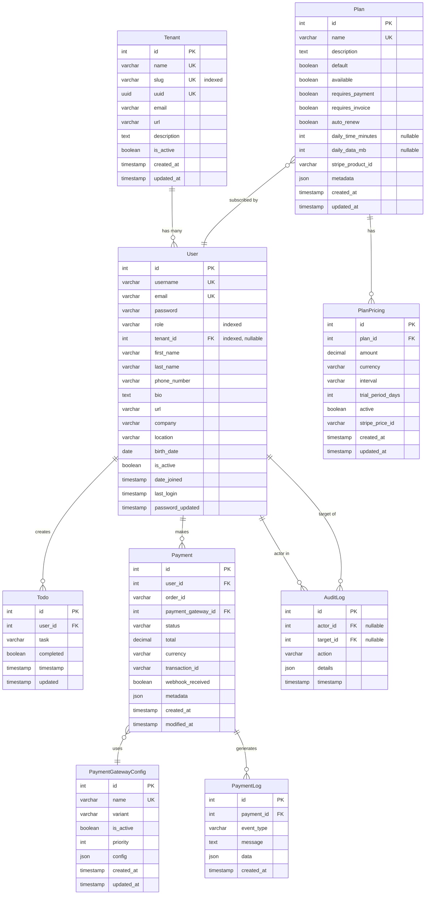
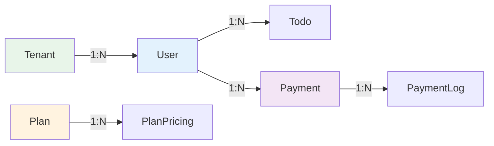
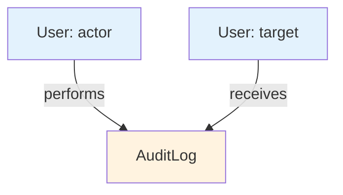
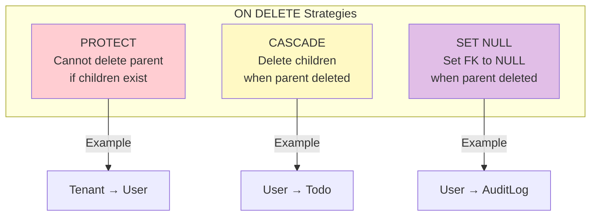

# Database Schema

This document provides a comprehensive overview of WiWebb's database schema, including entity relationships, field definitions, and design decisions.

## Complete Entity-Relationship Diagram



## Core Tables

### Tenant Table

Stores organization/customer information for multi-tenancy.

| Column | Type | Constraints | Description |
|--------|------|-------------|-------------|
| id | SERIAL | PRIMARY KEY | Auto-incrementing ID |
| name | VARCHAR(150) | UNIQUE, NOT NULL | Organization name |
| slug | VARCHAR(160) | UNIQUE, NOT NULL, INDEXED | URL-friendly identifier |
| uuid | UUID | UNIQUE, NOT NULL | Globally unique identifier |
| email | VARCHAR(254) | NULLABLE | Contact email |
| url | VARCHAR(200) | NULLABLE | Organization website |
| description | TEXT | NULLABLE | Organization description |
| is_active | BOOLEAN | DEFAULT TRUE | Active status |
| created_at | TIMESTAMP | AUTO_NOW_ADD | Creation timestamp |
| updated_at | TIMESTAMP | AUTO_NOW | Last update timestamp |

**Indexes:**
- `idx_tenant_slug` on `slug` (for URL lookups)
- `idx_tenant_name` on `name` (for searches)

**Design Notes:**

!!! info "UUID vs ID"
    Both `id` (integer) and `uuid` (UUID) are provided:
    - `id` for internal database joins (faster)
    - `uuid` for external API references (secure, non-sequential)

!!! tip "Slug Usage"
    The slug is used in URLs (e.g., `/tenants/acme-corp/`) for better UX and SEO.

### User Table

Custom user model extending Django's AbstractUser with roles and tenant association.

| Column | Type | Constraints | Description |
|--------|------|-------------|-------------|
| id | SERIAL | PRIMARY KEY | Auto-incrementing ID |
| username | VARCHAR(150) | UNIQUE, NOT NULL | Login username |
| email | VARCHAR(254) | UNIQUE, NOT NULL | Email address |
| password | VARCHAR(128) | NOT NULL | Hashed password |
| role | VARCHAR(20) | NOT NULL, INDEXED | User role (enum) |
| tenant_id | INTEGER | FOREIGN KEY, NULLABLE, INDEXED | Associated tenant |
| first_name | VARCHAR(150) | NULLABLE | First name |
| last_name | VARCHAR(150) | NULLABLE | Last name |
| phone_number | VARCHAR(20) | NULLABLE | Phone number |
| bio | TEXT | NULLABLE | Biography |
| url | VARCHAR(200) | NULLABLE | Personal website |
| company | VARCHAR(100) | NULLABLE | Company name |
| location | VARCHAR(100) | NULLABLE | Location |
| birth_date | DATE | NULLABLE | Date of birth |
| is_active | BOOLEAN | DEFAULT TRUE | Account active status |
| date_joined | TIMESTAMP | AUTO_NOW_ADD | Registration date |
| last_login | TIMESTAMP | NULLABLE | Last login time |
| password_updated | TIMESTAMP | AUTO_NOW | Password change time |

**Indexes:**
- `idx_user_role` on `role` (for permission checks)
- `idx_user_tenant` on `tenant_id` (for tenant filtering)
- `idx_user_role_tenant` on `(role, tenant_id)` (composite for common queries)
- `idx_user_email` on `email` (for lookups)

**Foreign Keys:**
- `tenant_id` → `Tenant.id` (ON DELETE PROTECT)

**Role Values:**
- `superadmin` - Full system access
- `admin` - Multi-tenant management
- `tenant_owner` - Single tenant management
- `subscriber` - End user

**Design Notes:**

!!! warning "PROTECT on Tenant Delete"
    Tenants cannot be deleted if they have users. This prevents data loss.

!!! info "Derived Properties"
    `is_staff` and `is_superuser` are computed from `role`, not stored in DB:
    ```python
    @property
    def is_staff(self):
        return self.role in ['superadmin', 'admin']
    ```

### Todo Table

Simple task management feature (demonstration of user-owned resources).

| Column | Type | Constraints | Description |
|--------|------|-------------|-------------|
| id | SERIAL | PRIMARY KEY | Auto-incrementing ID |
| user_id | INTEGER | FOREIGN KEY, NOT NULL | Owner user |
| task | VARCHAR(200) | NOT NULL | Task description |
| completed | BOOLEAN | DEFAULT FALSE | Completion status |
| timestamp | TIMESTAMP | AUTO_NOW_ADD | Creation time |
| updated | TIMESTAMP | AUTO_NOW | Last update time |

**Foreign Keys:**
- `user_id` → `User.id` (ON DELETE CASCADE)

**Design Notes:**

!!! info "CASCADE Delete"
    When a user is deleted, their todos are automatically deleted (orphaned data cleanup).

### AuditLog Table

Audit trail for sensitive user and tenant operations.

| Column | Type | Constraints | Description |
|--------|------|-------------|-------------|
| id | SERIAL | PRIMARY KEY | Auto-incrementing ID |
| actor_id | INTEGER | FOREIGN KEY, NULLABLE | User who performed action |
| target_id | INTEGER | FOREIGN KEY, NULLABLE | User affected by action |
| action | VARCHAR(50) | NOT NULL | Action type (enum) |
| details | JSONB | DEFAULT {} | Additional context |
| timestamp | TIMESTAMP | AUTO_NOW_ADD | When action occurred |

**Foreign Keys:**
- `actor_id` → `User.id` (ON DELETE SET NULL)
- `target_id` → `User.id` (ON DELETE SET NULL)

**Action Values:**
- `role_changed` - User role was modified
- `password_reset` - Password was reset
- `activation_changed` - User activation status changed

**Indexes:**
- `idx_auditlog_timestamp` on `timestamp DESC` (for recent logs)
- `idx_auditlog_actor` on `actor_id` (for who did what)
- `idx_auditlog_target` on `target_id` (for what happened to whom)

**Design Notes:**

!!! tip "SET NULL on User Delete"
    If a user is deleted, audit logs are preserved with NULL actor/target for historical records.

!!! info "JSONB Details Field"
    Flexible JSON field stores additional context:
    ```json
    {
      "old_role": "subscriber",
      "new_role": "tenant_owner",
      "changed_by": "admin@example.com"
    }
    ```

## Payment Tables

### Plan Table

Subscription plan definitions.

| Column | Type | Constraints | Description |
|--------|------|-------------|-------------|
| id | SERIAL | PRIMARY KEY | Auto-incrementing ID |
| name | VARCHAR(100) | UNIQUE, NOT NULL | Plan name |
| description | TEXT | NULLABLE | Plan description |
| default | BOOLEAN | DEFAULT FALSE | Default plan flag |
| available | BOOLEAN | DEFAULT TRUE | Availability status |
| requires_payment | BOOLEAN | DEFAULT TRUE | Payment required |
| requires_invoice | BOOLEAN | DEFAULT FALSE | Invoice required |
| auto_renew | BOOLEAN | DEFAULT TRUE | Auto-renewal enabled |
| daily_time_minutes | INTEGER | NULLABLE | Daily time limit (mins) |
| daily_data_mb | INTEGER | NULLABLE | Daily data limit (MB) |
| stripe_product_id | VARCHAR(255) | NULLABLE | Stripe Product ID |
| metadata | JSONB | DEFAULT {} | Additional data |
| created_at | TIMESTAMP | AUTO_NOW_ADD | Creation time |
| updated_at | TIMESTAMP | AUTO_NOW | Last update time |

**Design Notes:**

!!! info "Usage Limits"
    `daily_time_minutes` and `daily_data_mb` define policy enforcement limits.
    NULL values mean unlimited.

### PlanPricing Table

Pricing configurations for plans (one plan can have multiple pricing options).

| Column | Type | Constraints | Description |
|--------|------|-------------|-------------|
| id | SERIAL | PRIMARY KEY | Auto-incrementing ID |
| plan_id | INTEGER | FOREIGN KEY, NOT NULL | Associated plan |
| amount | DECIMAL(10,2) | NOT NULL | Price amount |
| currency | VARCHAR(3) | DEFAULT 'USD' | Currency code |
| interval | VARCHAR(10) | NOT NULL | Billing interval (enum) |
| trial_period_days | INTEGER | DEFAULT 0 | Trial period length |
| active | BOOLEAN | DEFAULT TRUE | Active status |
| stripe_price_id | VARCHAR(255) | NULLABLE | Stripe Price ID |
| created_at | TIMESTAMP | AUTO_NOW_ADD | Creation time |
| updated_at | TIMESTAMP | AUTO_NOW | Last update time |

**Foreign Keys:**
- `plan_id` → `Plan.id` (ON DELETE CASCADE)

**Interval Values:**
- `day` - Daily billing
- `week` - Weekly billing
- `month` - Monthly billing
- `year` - Yearly billing

**Example:**

```python
# Plan can have multiple pricing options
plan = Plan.objects.get(name="Professional")

# Monthly pricing
PlanPricing.objects.create(
    plan=plan,
    amount=19.99,
    currency='USD',
    interval='month',
    trial_period_days=14
)

# Yearly pricing (discounted)
PlanPricing.objects.create(
    plan=plan,
    amount=199.99,  # ~16.67/month
    currency='USD',
    interval='year',
    trial_period_days=14
)
```

### PaymentGatewayConfig Table

Configuration for payment gateways (Stripe, PayPal, etc.).

| Column | Type | Constraints | Description |
|--------|------|-------------|-------------|
| id | SERIAL | PRIMARY KEY | Auto-incrementing ID |
| name | VARCHAR(100) | UNIQUE, NOT NULL | Gateway name |
| variant | VARCHAR(50) | NOT NULL | Gateway type |
| is_active | BOOLEAN | DEFAULT TRUE | Active status |
| priority | INTEGER | DEFAULT 0 | Selection priority |
| config | JSONB | DEFAULT {} | Gateway configuration |
| created_at | TIMESTAMP | AUTO_NOW_ADD | Creation time |
| updated_at | TIMESTAMP | AUTO_NOW | Last update time |

### Payment Table

Payment transaction records.

| Column | Type | Constraints | Description |
|--------|------|-------------|-------------|
| id | SERIAL | PRIMARY KEY | Auto-incrementing ID |
| user_id | INTEGER | FOREIGN KEY, NOT NULL | Paying user |
| order_id | VARCHAR(100) | NULLABLE | Order reference |
| payment_gateway_id | INTEGER | FOREIGN KEY, NOT NULL | Used gateway |
| status | VARCHAR(20) | NOT NULL | Payment status |
| total | DECIMAL(10,2) | NOT NULL | Total amount |
| currency | VARCHAR(3) | DEFAULT 'USD' | Currency code |
| transaction_id | VARCHAR(255) | NULLABLE | Gateway transaction ID |
| webhook_received | BOOLEAN | DEFAULT FALSE | Webhook received flag |
| metadata | JSONB | DEFAULT {} | Additional data |
| created_at | TIMESTAMP | AUTO_NOW_ADD | Creation time |
| modified_at | TIMESTAMP | AUTO_NOW | Last modification |

**Foreign Keys:**
- `user_id` → `User.id` (ON DELETE PROTECT)
- `payment_gateway_id` → `PaymentGatewayConfig.id` (ON DELETE PROTECT)

**Status Values:**
- `waiting` - Awaiting payment
- `preauth` - Pre-authorized
- `confirmed` - Payment confirmed
- `rejected` - Payment rejected
- `refunded` - Payment refunded
- `error` - Payment error

**Indexes:**
- `idx_payment_user` on `user_id` (for user payment history)
- `idx_payment_status` on `status` (for status queries)
- `idx_payment_transaction_id` on `transaction_id` (for webhook lookups)

### PaymentLog Table

Detailed logging of payment events.

| Column | Type | Constraints | Description |
|--------|------|-------------|-------------|
| id | SERIAL | PRIMARY KEY | Auto-incrementing ID |
| payment_id | INTEGER | FOREIGN KEY, NOT NULL | Associated payment |
| event_type | VARCHAR(100) | NOT NULL | Event type |
| message | TEXT | NULLABLE | Event message |
| data | JSONB | DEFAULT {} | Event data |
| created_at | TIMESTAMP | AUTO_NOW_ADD | Event time |

**Foreign Keys:**
- `payment_id` → `Payment.id` (ON DELETE CASCADE)

**Indexes:**
- `idx_paymentlog_payment` on `payment_id` (for payment event history)
- `idx_paymentlog_created` on `created_at DESC` (for recent events)

## Relationship Details

### One-to-Many Relationships



### Self-Referencing Relationships



## Indexing Strategy

### Primary Indexes

All tables have a primary key index on `id`:
```sql
CREATE INDEX idx_<table>_pkey ON <table> (id);
```

### Foreign Key Indexes

All foreign keys are automatically indexed:
```sql
CREATE INDEX idx_user_tenant_id ON api_user (tenant_id);
CREATE INDEX idx_payment_user_id ON payment_payment (user_id);
```

### Composite Indexes

For common query patterns:
```sql
-- User queries often filter by role AND tenant
CREATE INDEX idx_user_role_tenant ON api_user (role, tenant_id);

-- Payment queries often filter by user AND status
CREATE INDEX idx_payment_user_status ON payment_payment (user_id, status);
```

### Unique Indexes

Enforce uniqueness:
```sql
CREATE UNIQUE INDEX idx_tenant_name ON api_tenant (name);
CREATE UNIQUE INDEX idx_tenant_slug ON api_tenant (slug);
CREATE UNIQUE INDEX idx_user_username ON api_user (username);
CREATE UNIQUE INDEX idx_user_email ON api_user (email);
```

## Data Integrity

### Referential Integrity



**Protection Strategy:**

| Relationship | ON DELETE | Reason |
|--------------|-----------|--------|
| Tenant → User | PROTECT | Prevent accidental tenant deletion |
| User → Payment | PROTECT | Preserve payment history |
| User → Todo | CASCADE | Clean up orphaned todos |
| User → AuditLog | SET NULL | Keep audit trail |
| Plan → PlanPricing | CASCADE | Pricing tied to plan |
| Payment → PaymentLog | CASCADE | Logs are payment-specific |

### Constraints

**Unique Constraints:**
```sql
ALTER TABLE api_tenant ADD CONSTRAINT unique_tenant_name UNIQUE (name);
ALTER TABLE api_tenant ADD CONSTRAINT unique_tenant_slug UNIQUE (slug);
ALTER TABLE api_user ADD CONSTRAINT unique_user_email UNIQUE (email);
```

**Check Constraints:**
```sql
-- Ensure amounts are positive
ALTER TABLE payment_planpricing
ADD CONSTRAINT check_amount_positive CHECK (amount >= 0);

-- Ensure trial period is non-negative
ALTER TABLE payment_planpricing
ADD CONSTRAINT check_trial_positive CHECK (trial_period_days >= 0);
```

## Database Migrations

WiWebb uses Django migrations for schema changes:

```bash
# Create migrations
python manage.py makemigrations

# Apply migrations
python manage.py migrate

# View migration history
python manage.py showmigrations

# Reverse a migration
python manage.py migrate api 0003_previous_migration
```

### Initial Migrations

```
api/migrations/
├── 0001_initial.py              # Create Tenant, User, Todo
├── 0002_add_auditlog.py         # Add AuditLog model
└── 0003_add_indexes.py          # Add composite indexes

payment_gateway/migrations/
├── 0001_initial.py              # Create payment models
└── 0002_add_stripe_fields.py    # Add Stripe integration fields
```

## Performance Considerations

### Query Optimization

```python
# Bad: N+1 queries
users = User.objects.all()
for user in users:
    print(user.tenant.name)  # Separate query each iteration!

# Good: 1 query with join
users = User.objects.select_related('tenant').all()
for user in users:
    print(user.tenant.name)  # No additional query

# Bad: Multiple queries for reverse relations
tenants = Tenant.objects.all()
for tenant in tenants:
    print(tenant.users.count())  # Query for each tenant!

# Good: Prefetch with annotation
from django.db.models import Count
tenants = Tenant.objects.annotate(user_count=Count('users'))
for tenant in tenants:
    print(tenant.user_count)  # No additional queries
```

### Connection Pooling

For production, use connection pooling:

```python
# settings.py
DATABASES = {
    'default': {
        'ENGINE': 'django.db.backends.postgresql',
        'CONN_MAX_AGE': 600,  # 10 minutes
        'OPTIONS': {
            'connect_timeout': 10,
        }
    }
}
```

## Backup Strategy

### Backup Commands

```bash
# Full database backup
docker compose exec django_db pg_dump -U django_user django_db > backup.sql

# Compressed backup
docker compose exec django_db pg_dump -U django_user django_db | gzip > backup.sql.gz

# Restore from backup
docker compose exec -T django_db psql -U django_user django_db < backup.sql
```

### Automated Backups

```bash
#!/bin/bash
# backup.sh - Daily backup script

DATE=$(date +%Y%m%d)
BACKUP_DIR="/backups"
DB_NAME="django_db"

docker compose exec django_db pg_dump -U django_user $DB_NAME | \
  gzip > "$BACKUP_DIR/wiwebb_$DATE.sql.gz"

# Keep only last 7 days
find $BACKUP_DIR -name "wiwebb_*.sql.gz" -mtime +7 -delete
```

## Next Steps

Explore related architecture documentation:

- **[Backend Architecture](backend.md)** - Django implementation details
- **[Authentication](authentication.md)** - Auth flow and token management
- **[Multi-Tenancy](multi-tenancy.md)** - Tenant isolation strategies
- **[API Reference](../api-reference/models.md)** - Complete model API documentation

---

!!! question "Need Help?"
    For database-related questions, contact dev@thinesoft.com
