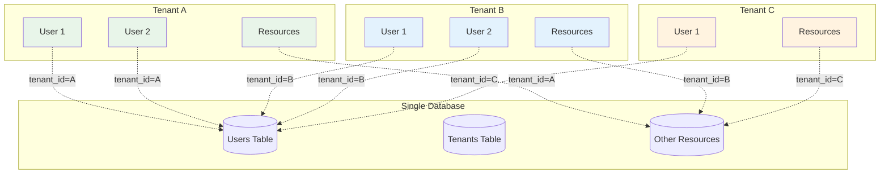
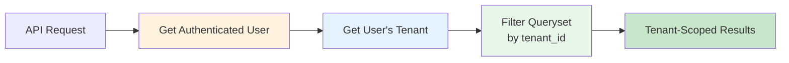
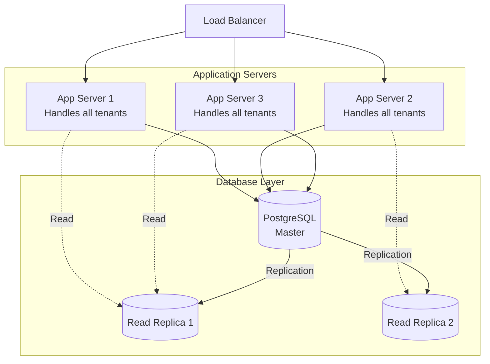
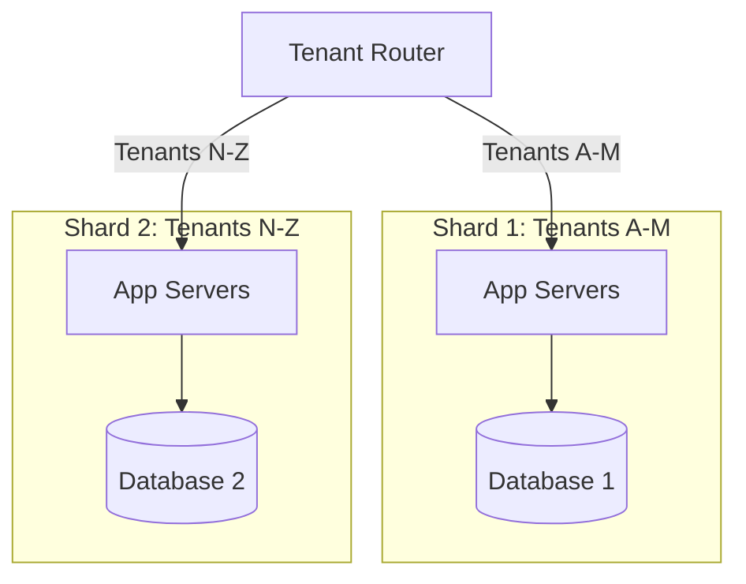

# Multi-Tenancy Architecture

This document explains WiWebb's multi-tenant architecture, tenant isolation mechanisms, and best practices for building multi-tenant features.

## Multi-Tenancy Overview

WiWebb implements a **shared database, shared schema** multi-tenancy pattern where:

- All tenants share the same database instance
- All tenants share the same tables
- Data isolation is enforced at the application level
- Each tenant's data is identified by a `tenant_id` foreign key



## Multi-Tenancy Patterns

### Pattern Comparison

| Pattern | Database | Schema | Isolation | Cost | Complexity | WiWebb Uses |
|---------|----------|--------|-----------|------|------------|-------------|
| Separate Database | Per-tenant | Per-tenant | Highest | Highest | High | ❌ |
| Shared Database, Separate Schema | Shared | Per-tenant | High | Medium | Medium | ❌ |
| Shared Database, Shared Schema | Shared | Shared | Application | Lowest | Low | ✅ |

### Why Shared Database/Schema?

!!! tip "Benefits of Shared Database Pattern"
    - **Cost-effective**: Single database for all tenants
    - **Easy maintenance**: Single schema to migrate
    - **Resource efficiency**: Shared connection pools
    - **Scalability**: Add tenants without infrastructure changes
    - **Backup simplicity**: One database to backup
    - **Development speed**: Simpler local development

!!! warning "Tradeoffs"
    - **Security**: Must be vigilant about tenant isolation
    - **Performance**: Large tenants can affect small ones (mitigated with indexing)
    - **Customization**: Limited per-tenant schema customization

## Tenant Model

### Tenant Entity

```python title="api/models.py"
class Tenant(models.Model):
    """Organization/customer entity."""

    # Identifiers
    id = models.AutoField(primary_key=True)
    uuid = models.UUIDField(default=uuid.uuid4, unique=True)
    slug = models.SlugField(max_length=160, unique=True, db_index=True)

    # Information
    name = models.CharField(max_length=150, unique=True)
    email = models.EmailField(blank=True, null=True)
    url = models.URLField(blank=True, null=True)
    description = models.TextField(blank=True)

    # Status
    is_active = models.BooleanField(default=True)

    # Timestamps
    created_at = models.DateTimeField(auto_now_add=True)
    updated_at = models.DateTimeField(auto_now=True)

    class Meta:
        ordering = ('name',)
        indexes = [
            models.Index(fields=['slug']),
            models.Index(fields=['is_active']),
        ]

    def __str__(self):
        return self.name
```

### Tenant-Scoped Models

Models that belong to a tenant must include a `tenant` foreign key:

```python
class TenantScopedModel(models.Model):
    """Base class for tenant-scoped resources."""

    tenant = models.ForeignKey(
        Tenant,
        on_delete=models.PROTECT,  # Don't allow tenant deletion
        db_index=True,  # Index for fast filtering
        help_text="The tenant this resource belongs to"
    )

    class Meta:
        abstract = True  # This is a base class, not a table
```

## Data Isolation

### Automatic Queryset Filtering



### ViewSet Implementation

```python title="api/views.py"
from rest_framework import viewsets
from rest_framework.permissions import IsAuthenticated

class TenantScopedViewSet(viewsets.ModelViewSet):
    """Base viewset for tenant-scoped resources."""

    permission_classes = [IsAuthenticated]

    def get_queryset(self):
        """Automatically filter by tenant."""
        user = self.request.user

        # SuperAdmin and Admin see all
        if user.role in ['superadmin', 'admin']:
            return self.queryset.all()

        # Tenant Owner and Subscriber see only their tenant's data
        if user.tenant:
            return self.queryset.filter(tenant=user.tenant)

        # No tenant = no data
        return self.queryset.none()

    def perform_create(self, serializer):
        """Automatically set tenant on creation."""
        user = self.request.user

        # If user has a tenant, assign it
        if user.tenant:
            serializer.save(tenant=user.tenant)
        else:
            # SuperAdmin/Admin must explicitly set tenant
            serializer.save()
```

### Example Usage

```python title="api/views.py"
class NetworkDeviceViewSet(TenantScopedViewSet):
    """ViewSet for network devices."""

    queryset = NetworkDevice.objects.all()
    serializer_class = NetworkDeviceSerializer

    # Tenant filtering is automatic from base class!
```

## Tenant Isolation Levels

### Level 1: Database Query Filtering

**What:** Filter queries by `tenant_id`

**When:** Every database query

**Implementation:**
```python
# Bad: No tenant filtering (security risk!)
devices = NetworkDevice.objects.all()

# Good: Filtered by tenant
devices = NetworkDevice.objects.filter(tenant=user.tenant)
```

### Level 2: Serializer Validation

**What:** Validate tenant ownership on create/update

**When:** API requests with data

**Implementation:**
```python
class NetworkDeviceSerializer(serializers.ModelSerializer):
    def validate(self, attrs):
        """Ensure user can only create resources in their tenant."""
        user = self.context['request'].user

        if 'tenant' in attrs:
            # If tenant specified, verify user has access
            if user.role not in ['superadmin', 'admin']:
                if attrs['tenant'] != user.tenant:
                    raise serializers.ValidationError(
                        "Cannot create resources in other tenants"
                    )

        return attrs
```

### Level 3: Object-Level Permissions

**What:** Check tenant ownership before accessing individual objects

**When:** Detail views (retrieve, update, delete)

**Implementation:**
```python
class IsTenantOwner(permissions.BasePermission):
    """Ensure object belongs to user's tenant."""

    def has_object_permission(self, request, view, obj):
        user = request.user

        # Admin can access any tenant's objects
        if user.role in ['superadmin', 'admin']:
            return True

        # Check if object belongs to user's tenant
        if hasattr(obj, 'tenant'):
            return obj.tenant == user.tenant

        return False
```

### Level 4: URL Isolation

**What:** Include tenant in URLs

**When:** Tenant-specific resources

**Implementation:**
```python
# URL structure
/api/v1/tenants/{tenant_slug}/devices/
/api/v1/tenants/{tenant_slug}/users/

# Validate tenant matches user
def get_queryset(self):
    tenant_slug = self.kwargs.get('tenant_slug')
    user = self.request.user

    if user.role in ['superadmin', 'admin']:
        return self.queryset.filter(tenant__slug=tenant_slug)

    # Non-admins can only access their own tenant
    if user.tenant and user.tenant.slug == tenant_slug:
        return self.queryset.filter(tenant=user.tenant)

    return self.queryset.none()
```

## Tenant Context

### Request Context

Store tenant in request for easy access:

```python title="api/middleware.py"
class TenantMiddleware:
    """Add tenant to request object."""

    def __init__(self, get_response):
        self.get_response = get_response

    def __call__(self, request):
        if request.user.is_authenticated and request.user.tenant:
            request.tenant = request.user.tenant
        else:
            request.tenant = None

        response = self.get_response(request)
        return response
```

Usage in views:

```python
def my_view(request):
    tenant = request.tenant  # Easy access!
    if tenant:
        # Do tenant-specific logic
        pass
```

## Cross-Tenant Operations

### When SuperAdmins Need All Data

```python
class UserViewSet(viewsets.ModelViewSet):
    """User management with cross-tenant support."""

    def get_queryset(self):
        user = self.request.user

        # SuperAdmin sees all users across all tenants
        if user.role == 'superadmin':
            return User.objects.select_related('tenant').all()

        # Admin sees all users but with tenant context
        if user.role == 'admin':
            return User.objects.select_related('tenant').all()

        # Tenant Owner sees only their tenant's users
        if user.role == 'tenant_owner' and user.tenant:
            return User.objects.filter(tenant=user.tenant)

        # Subscribers see only themselves
        return User.objects.filter(id=user.id)
```

### Tenant Statistics

Aggregating across tenants for admins:

```python
from django.db.models import Count, Sum

def get_tenant_statistics():
    """Get statistics across all tenants."""
    return Tenant.objects.annotate(
        user_count=Count('users'),
        active_user_count=Count('users', filter=Q(users__is_active=True)),
        subscription_count=Count('subscriptions'),
    )
```

## Security Considerations

### Preventing Tenant Data Leakage

!!! danger "Critical Security Rules"
    1. **Always filter by tenant** in queries
    2. **Never trust client-provided tenant_id**
    3. **Validate tenant ownership** before updates
    4. **Use object-level permissions**
    5. **Audit cross-tenant access**

### Common Security Pitfalls

??? warning "Pitfall 1: Trusting Client Input"
    **Bad:**
    ```python
    def create_device(request):
        # Client can specify any tenant_id!
        tenant_id = request.data.get('tenant_id')
        device = Device.objects.create(
            name=request.data['name'],
            tenant_id=tenant_id  # ❌ SECURITY RISK
        )
    ```

    **Good:**
    ```python
    def create_device(request):
        # Use authenticated user's tenant
        device = Device.objects.create(
            name=request.data['name'],
            tenant=request.user.tenant  # ✅ SAFE
        )
    ```

??? warning "Pitfall 2: Forgetting to Filter"
    **Bad:**
    ```python
    def get_devices(request):
        # Returns ALL devices from ALL tenants!
        devices = Device.objects.all()  # ❌ DATA LEAK
        return Response(DeviceSerializer(devices, many=True).data)
    ```

    **Good:**
    ```python
    def get_devices(request):
        # Only user's tenant's devices
        devices = Device.objects.filter(tenant=request.user.tenant)  # ✅ SAFE
        return Response(DeviceSerializer(devices, many=True).data)
    ```

??? warning "Pitfall 3: Exposed IDs in URLs"
    **Bad:**
    ```python
    # URL: /api/devices/123/
    # User can guess IDs and access other tenants' devices!
    ```

    **Good:**
    ```python
    # Always check object permissions
    class DeviceViewSet(viewsets.ModelViewSet):
        permission_classes = [IsAuthenticated, IsTenantOwner]

        def get_object(self):
            obj = super().get_object()
            # IsTenantOwner permission checks tenant ownership
            return obj
    ```

## Testing Multi-Tenancy

### Unit Tests

```python title="api/tests/test_multi_tenancy.py"
from django.test import TestCase
from api.models import Tenant, User, NetworkDevice

class MultiTenancyTestCase(TestCase):
    def setUp(self):
        # Create two tenants
        self.tenant_a = Tenant.objects.create(
            name="Tenant A",
            slug="tenant-a"
        )
        self.tenant_b = Tenant.objects.create(
            name="Tenant B",
            slug="tenant-b"
        )

        # Create users in each tenant
        self.user_a = User.objects.create_user(
            username='user_a',
            password='password',
            tenant=self.tenant_a,
            role=User.Roles.SUBSCRIBER
        )
        self.user_b = User.objects.create_user(
            username='user_b',
            password='password',
            tenant=self.tenant_b,
            role=User.Roles.SUBSCRIBER
        )

        # Create devices for each tenant
        self.device_a = NetworkDevice.objects.create(
            name="Device A",
            tenant=self.tenant_a
        )
        self.device_b = NetworkDevice.objects.create(
            name="Device B",
            tenant=self.tenant_b
        )

    def test_user_can_only_see_own_tenant_devices(self):
        """Test that users cannot see other tenants' devices."""
        # Login as user A
        self.client.force_authenticate(user=self.user_a)

        # Get devices
        response = self.client.get('/api/v1/devices/')

        # Should only see device A
        self.assertEqual(response.status_code, 200)
        self.assertEqual(len(response.data), 1)
        self.assertEqual(response.data[0]['id'], self.device_a.id)

    def test_user_cannot_access_other_tenant_device(self):
        """Test that users cannot access other tenants' device details."""
        # Login as user A
        self.client.force_authenticate(user=self.user_a)

        # Try to access device B
        response = self.client.get(f'/api/v1/devices/{self.device_b.id}/')

        # Should be forbidden
        self.assertEqual(response.status_code, 403)

    def test_user_cannot_create_device_in_other_tenant(self):
        """Test that users cannot create devices in other tenants."""
        # Login as user A
        self.client.force_authenticate(user=self.user_a)

        # Try to create device in tenant B
        response = self.client.post('/api/v1/devices/', {
            'name': 'Malicious Device',
            'tenant': self.tenant_b.id  # Different tenant!
        })

        # Should be rejected
        self.assertEqual(response.status_code, 400)
```

## Performance Optimization

### Indexing Strategy

All tenant foreign keys should be indexed:

```python
class TenantScopedModel(models.Model):
    tenant = models.ForeignKey(
        Tenant,
        db_index=True,  # ✅ CRITICAL FOR PERFORMANCE
        on_delete=models.PROTECT
    )
```

### Composite Indexes

For common query patterns:

```sql
-- Frequently filter by tenant AND status
CREATE INDEX idx_device_tenant_status
ON network_devices (tenant_id, status);

-- Frequently filter by tenant AND created date
CREATE INDEX idx_payment_tenant_created
ON payments (tenant_id, created_at DESC);
```

### Query Optimization

```python
# Bad: N+1 queries
devices = Device.objects.filter(tenant=tenant)
for device in devices:
    print(device.tenant.name)  # Separate query each time!

# Good: Single query with join
devices = Device.objects.filter(tenant=tenant).select_related('tenant')
for device in devices:
    print(device.tenant.name)  # No additional query
```

## Scaling Multi-Tenancy

### Horizontal Scaling



### Tenant-Based Sharding (Future)

For extremely large deployments:



## Best Practices

!!! tip "Multi-Tenancy Best Practices"
    1. **Always filter by tenant** in querysets
    2. **Index all tenant foreign keys** for performance
    3. **Use object-level permissions** for detail views
    4. **Test tenant isolation** thoroughly
    5. **Audit cross-tenant access** by admins
    6. **Never trust client tenant_id** in requests
    7. **Use middleware** for tenant context
    8. **Implement base classes** for tenant-scoped models
    9. **Monitor tenant growth** for scaling decisions
    10. **Document tenant relationships** in models

## Troubleshooting

??? warning "User sees data from other tenants"
    **Cause:** Missing tenant filter in queryset

    **Solution:**
    ```python
    # Add tenant filter
    def get_queryset(self):
        return self.queryset.filter(tenant=self.request.user.tenant)
    ```

??? warning "Slow queries with many tenants"
    **Cause:** Missing index on tenant_id

    **Solution:**
    ```python
    class MyModel(models.Model):
        tenant = models.ForeignKey(
            Tenant,
            db_index=True  # Add this!
        )
    ```

??? warning "Cannot delete tenant"
    **Cause:** PROTECT constraint on related objects

    **Solution:**
    ```python
    # Delete all tenant's data first
    tenant.users.all().delete()
    tenant.devices.all().delete()
    # Then delete tenant
    tenant.delete()
    ```

## Next Steps

- **[Backend Architecture](backend.md)** - Model implementation details
- **[Database Schema](database-schema.md)** - Table relationships
- **[Authentication](authentication.md)** - Role-based access control
- **[User Guide](../user-guide/organizations/tenants.md)** - Managing tenants

---

!!! info "Questions?"
    For multi-tenancy questions, contact dev@thinesoft.com
