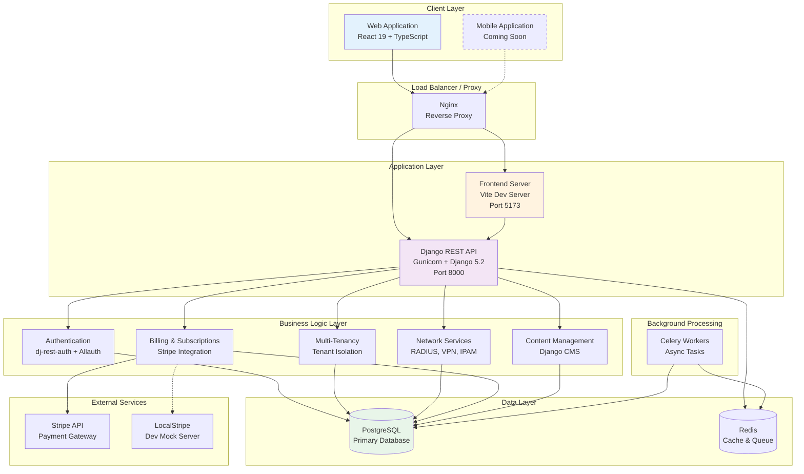
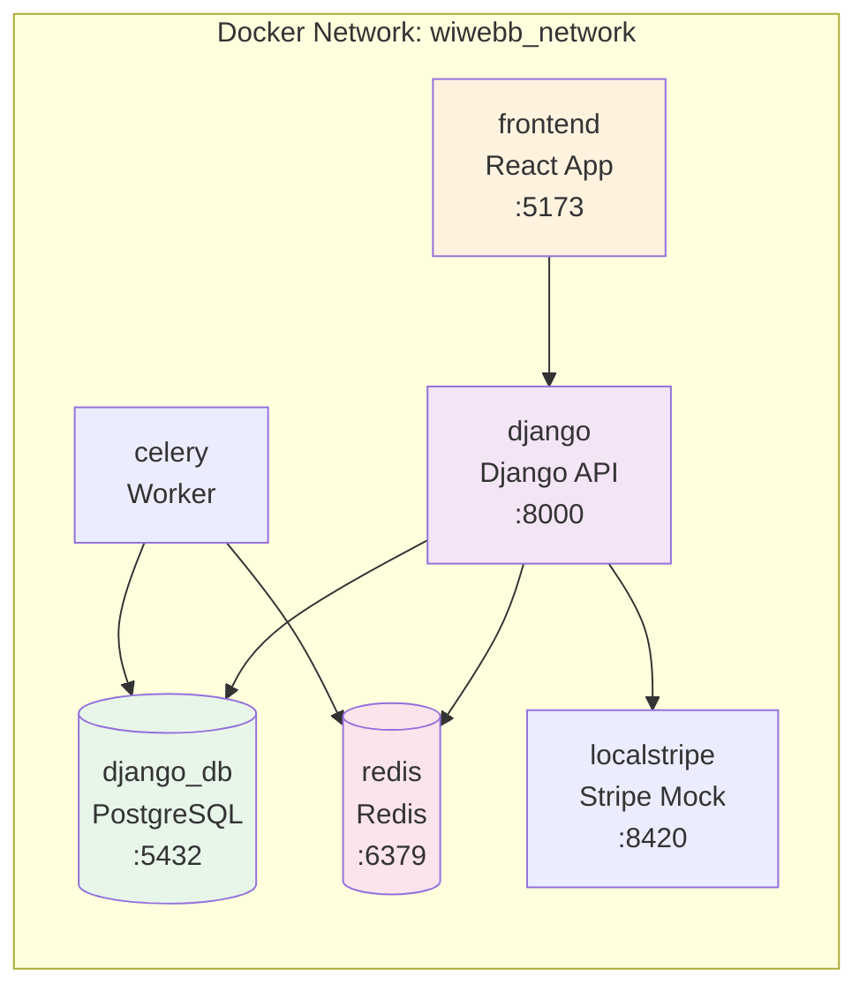
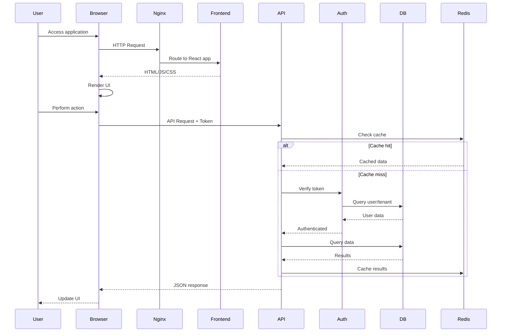
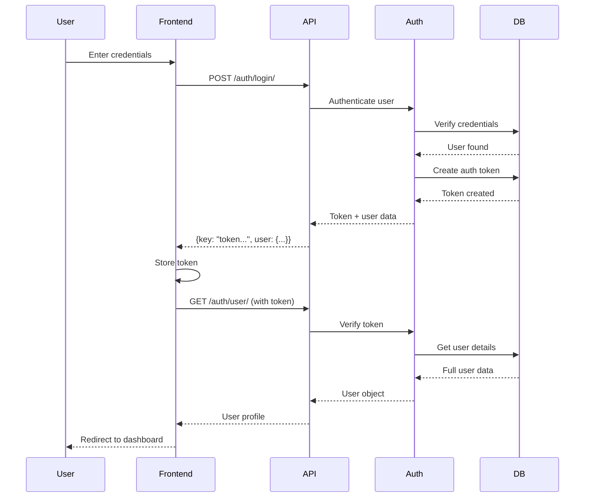
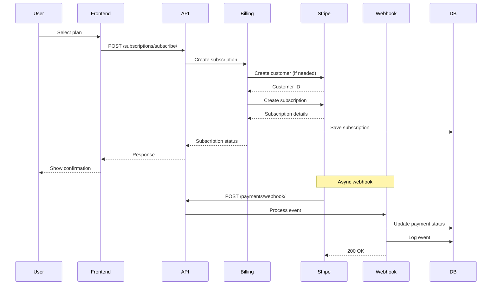
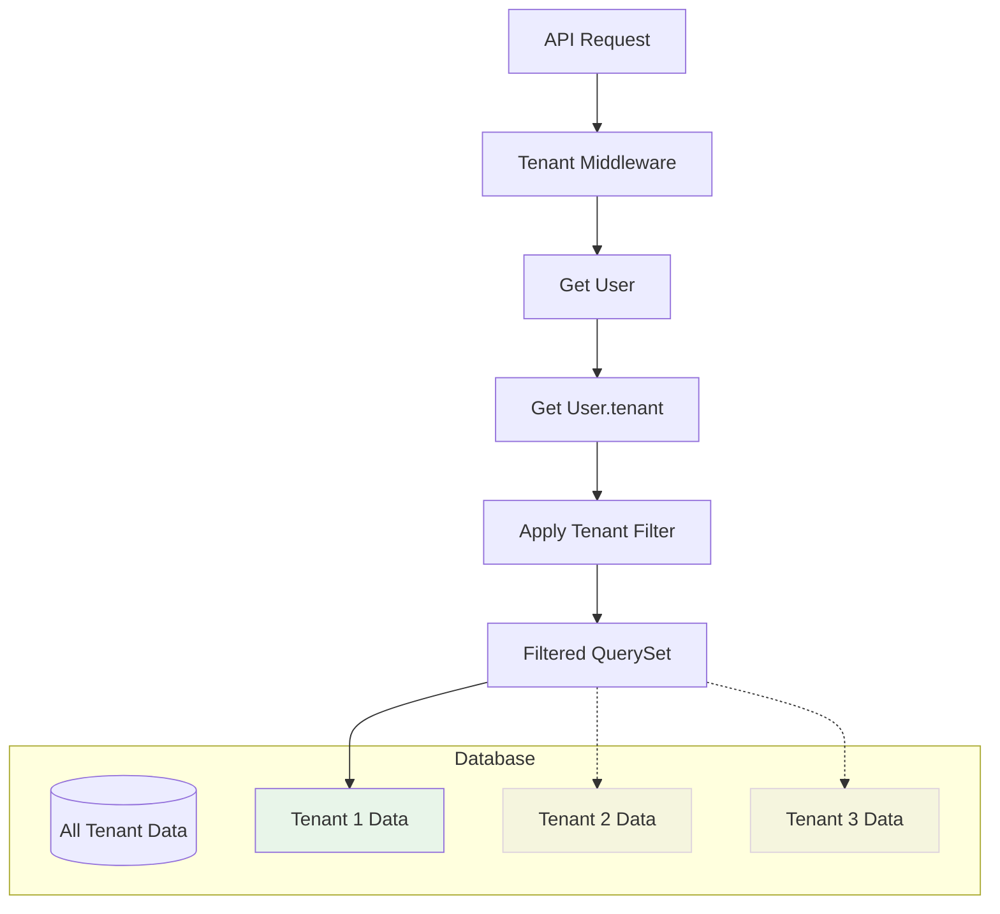
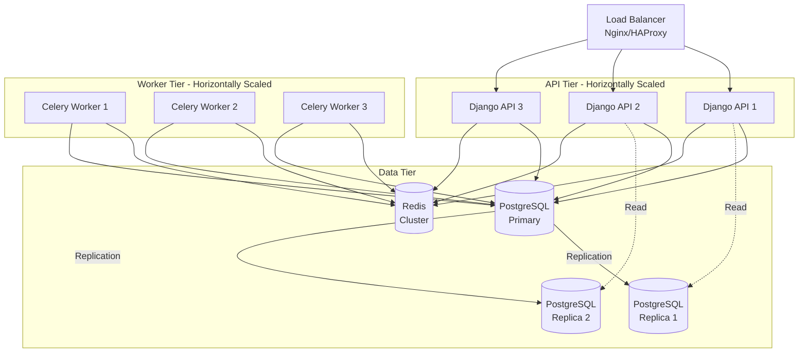
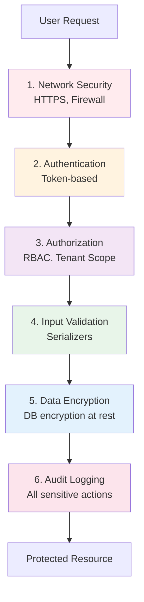
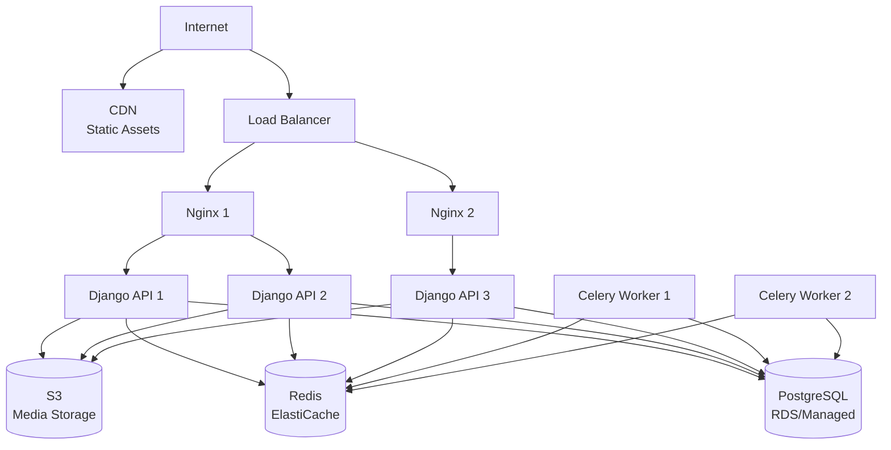
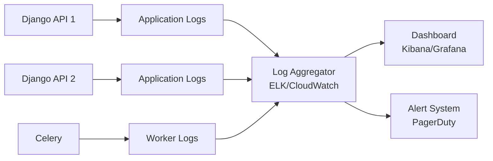

# Architecture Overview

This document provides a comprehensive overview of WiWebb's system architecture, including its components, data flow, and design decisions.

## System Architecture

WiWebb is built on a modern, containerized microservices architecture designed for scalability, maintainability, and multi-tenancy.

### High-Level Architecture



## Technology Stack

### Frontend

| Component | Technology | Version | Purpose |
|-----------|------------|---------|---------|
| Framework | React | 19.1.1 | UI library |
| Language | TypeScript | Latest | Type-safe development |
| Build Tool | Vite | 7.1.2 | Fast bundling |
| State Management | TanStack Query | 5.85.5 | Server state management |
| Routing | React Router | 7.8.1 | Client-side routing |
| UI Components | shadcn/ui | Latest | Component library |
| Styling | Tailwind CSS | 4.1.12 | Utility-first CSS |
| Charts | Recharts | Latest | Data visualization |
| Forms | React Hook Form + Zod | Latest | Form validation |

### Backend

| Component | Technology | Version | Purpose |
|-----------|------------|---------|---------|
| Framework | Django | 5.2.3 | Web framework |
| API Framework | Django REST Framework | Latest | RESTful APIs |
| Language | Python | 3.11+ | Backend language |
| Database | PostgreSQL | 14+ | Primary database |
| Cache/Queue | Redis | 7+ | Caching & task queue |
| Task Queue | Celery | Latest | Async task processing |
| Auth | dj-rest-auth + Allauth | Latest | Authentication |
| Payments | dj-stripe + django-payments | Latest | Payment processing |
| CMS | Django CMS | 5.0.1 | Content management |

### Infrastructure

| Component | Technology | Purpose |
|-----------|------------|---------|
| Containerization | Docker | Application packaging |
| Orchestration | Docker Compose | Multi-container deployment |
| Web Server | Nginx | Reverse proxy (production) |
| WSGI Server | Gunicorn | Python application server |
| Payment Dev | LocalStripe | Stripe mock server |

## Container Architecture

WiWebb runs as multiple Docker containers orchestrated by Docker Compose:



### Container Details

#### django
- **Image:** Custom (built from Dockerfile)
- **Purpose:** Django REST API server
- **Exposed Ports:** 8000
- **Volumes:**
    - `./backend:/app` (source code)
    - `static_volume:/app/staticfiles` (static files)
    - `media_volume:/app/mediafiles` (media uploads)
- **Dependencies:** django_db, redis

#### frontend
- **Image:** Custom (built from Dockerfile)
- **Purpose:** React development server
- **Exposed Ports:** 5173
- **Volumes:** `./frontend:/app` (source code)
- **Environment:** `VITE_API_URL` for backend connection

#### django_db
- **Image:** postgres:14-alpine
- **Purpose:** Primary PostgreSQL database
- **Exposed Ports:** 5432 (internal only)
- **Volumes:** `postgres_data:/var/lib/postgresql/data`
- **Environment:** Database credentials from `.env`

#### redis
- **Image:** redis:7-alpine
- **Purpose:** Cache and Celery broker
- **Exposed Ports:** 6379 (internal only)
- **Volumes:** `redis_data:/data`

#### localstripe
- **Image:** stripe/stripe-mock
- **Purpose:** Mock Stripe API for development
- **Exposed Ports:** 8420
- **Condition:** Only in development (`USE_LOCALSTRIPE=True`)

#### celery
- **Image:** Same as django
- **Purpose:** Background task worker
- **Command:** `celery -A backend worker --loglevel=info`
- **Dependencies:** redis, django_db

## Data Flow Architecture

### Request Flow



### Authentication Flow



### Payment Flow



## Application Layers

### Presentation Layer

**Responsibility:** User interface and user experience

**Components:**
- React components (pages, layouts, forms)
- Routing (React Router)
- State management (TanStack Query, Context)
- UI components (shadcn/ui)

**Key Directories:**
```
frontend/src/
├── pages/          # Route components
├── components/     # Reusable UI components
├── layouts/        # Layout components
├── hooks/          # Custom React hooks
└── context/        # React Context providers
```

### API Layer

**Responsibility:** HTTP endpoints and request/response handling

**Components:**
- Django REST Framework views
- Serializers for data transformation
- URL routing
- Permission classes

**Key Directories:**
```
backend/
├── api/views.py              # User/Tenant API views
├── api/serializers.py        # Data serialization
├── payment_gateway/views.py  # Payment API views
└── payment_gateway/serializers.py
```

### Business Logic Layer

**Responsibility:** Core application logic and business rules

**Components:**
- Django models
- Model managers and querysets
- Business logic methods
- Service classes

**Key Files:**
- `api/models.py` - User, Tenant, Todo, AuditLog
- `payment_gateway/models.py` - Plans, Payments, Subscriptions

### Data Access Layer

**Responsibility:** Database interactions and data persistence

**Components:**
- Django ORM
- Model managers
- Database migrations
- Indexing strategies

## Multi-Tenancy Architecture

WiWebb implements **shared database with tenant isolation** pattern:



### Tenant Isolation Mechanism

**Queryset Scoping:**
```python
# Automatic tenant filtering in views
class TenantViewSet(viewsets.ModelViewSet):
    def get_queryset(self):
        user = self.request.user
        if user.role in ["superadmin", "admin"]:
            # See all tenants
            return Tenant.objects.all()
        else:
            # See only own tenant
            return Tenant.objects.filter(id=user.tenant_id)
```

**Benefits:**
- Single database reduces infrastructure complexity
- Data isolation enforced at application level
- Cost-effective for scaling
- Easier backups and maintenance

**Security:**
- Tenant ID in all queries
- Row-level security
- Audit logging for all sensitive actions

## Scalability Design

### Horizontal Scaling



### Caching Strategy

**Redis Caching:**
- Session data
- User authentication tokens
- API response caching
- Database query result caching

**Cache Invalidation:**
- Time-based expiration
- Event-based invalidation
- Manual cache clearing

## Security Architecture

### Defense in Depth



### Security Features

1. **Authentication:** Token-based (django-rest-auth)
2. **Authorization:** Role-based access control (RBAC)
3. **Multi-tenancy:** Tenant-scoped data access
4. **Input Validation:** Django REST Framework serializers
5. **SQL Injection:** Django ORM parameterized queries
6. **XSS Protection:** Django templates auto-escaping
7. **CSRF Protection:** Django CSRF middleware
8. **Audit Logging:** All user/tenant modifications logged

## Performance Optimization

### Database Optimization

**Indexing Strategy:**
```python
class User(AbstractUser):
    tenant = models.ForeignKey(
        Tenant,
        db_index=True,  # Indexed for fast filtering
        ...
    )
    role = models.CharField(
        db_index=True,  # Indexed for permission checks
        ...
    )
```

**Query Optimization:**
- Select related / prefetch related for joins
- Queryset caching with Redis
- Database connection pooling
- Read replicas for scaling

### API Optimization

- Pagination for large result sets
- Field filtering in serializers
- Response compression
- HTTP caching headers

## Deployment Architecture

### Production Deployment



## Monitoring and Observability

### Logging Architecture



### Metrics Collection

- **Application Metrics:** Request rate, latency, errors
- **System Metrics:** CPU, memory, disk usage
- **Database Metrics:** Query performance, connection pool
- **Business Metrics:** User signups, subscriptions, payments

## Design Principles

### SOLID Principles

- **Single Responsibility:** Each model/view has one clear purpose
- **Open/Closed:** Extensible via Django apps
- **Liskov Substitution:** Proper use of base classes
- **Interface Segregation:** Focused serializers and viewsets
- **Dependency Inversion:** Dependency injection via Django

### Django Best Practices

- **Fat Models, Thin Views:** Business logic in models
- **DRY (Don't Repeat Yourself):** Shared utilities and mixins
- **12-Factor App:** Environment-based configuration
- **RESTful API Design:** Standard HTTP methods and status codes

## Next Steps

Dive deeper into specific architectural components:

- **[Backend Architecture](backend.md)** - Django app structure and design
- **[Frontend Architecture](frontend.md)** - React app structure and patterns
- **[Database Schema](database-schema.md)** - Entity relationships and models
- **[Authentication](authentication.md)** - Auth flow and security
- **[Multi-Tenancy](multi-tenancy.md)** - Tenant isolation details

---

!!! info "Questions?"
    For architectural questions or suggestions, contact the development team at dev@thinesoft.com
