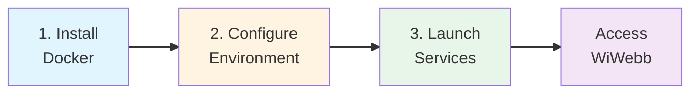
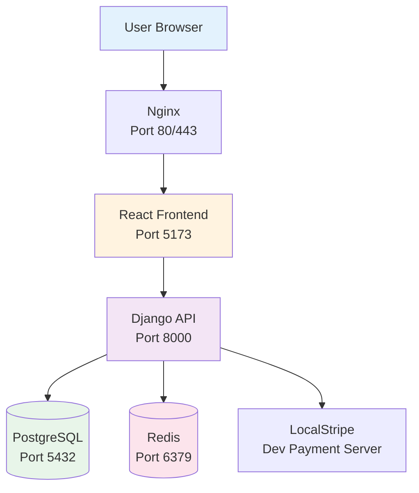

# Getting Started with WiWebb

Welcome! This guide will help you get WiWebb up and running quickly.

## What You'll Learn

This getting started guide covers everything you need to begin using WiWebb:

1. **[Installation](installation.md)** - Set up WiWebb using Docker
2. **[Quick Start](quick-start.md)** - Your first steps with WiWebb
3. **[Configuration](configuration.md)** - Configure WiWebb for your environment

## Prerequisites

Before you begin, ensure you have:

!!! warning "System Requirements"
    - **Docker** 20.10 or higher
    - **Docker Compose** 2.0 or higher
    - **4GB RAM** minimum (8GB recommended)
    - **10GB disk space** for containers and data
    - **Linux, macOS, or Windows** with WSL2

!!! tip "Docker Installation"
    If you don't have Docker installed, visit [docker.com](https://www.docker.com/get-started) for installation instructions for your operating system.

## Overview of the Setup Process

Setting up WiWebb involves three main steps:

### 1. Installation

The installation process involves:

- Cloning the WiWebb repository
- Setting up environment variables
- Building and starting Docker containers
- Running initial database migrations
- Creating your first admin user

**Estimated time:** 10-15 minutes

[:octicons-arrow-right-24: Go to Installation Guide](installation.md)

### 2. Quick Start

Once installed, you'll learn how to:

- Log in to the web interface
- Create your first tenant (organization)
- Add users and assign roles
- Navigate the dashboard

**Estimated time:** 5-10 minutes

[:octicons-arrow-right-24: Go to Quick Start Guide](quick-start.md)

### 3. Configuration

Configure WiWebb for your specific needs:

- Environment variables
- Database settings
- Stripe payment integration
- Email configuration
- Security settings

**Estimated time:** 15-30 minutes

[:octicons-arrow-right-24: Go to Configuration Guide](configuration.md)

## Architecture at a Glance

WiWebb uses a modern containerized architecture:

All services run in Docker containers, making deployment and scaling simple.

## Next Steps

Ready to begin? Start with the [Installation Guide](installation.md) to get WiWebb running on your system.

!!! question "Need Help?"
    If you encounter issues during setup:

    - Check the [Troubleshooting Guide](../troubleshooting/common-issues.md)
    - Review the [FAQ](../troubleshooting/faq.md)
    - Contact support at support@thinesoft.com
