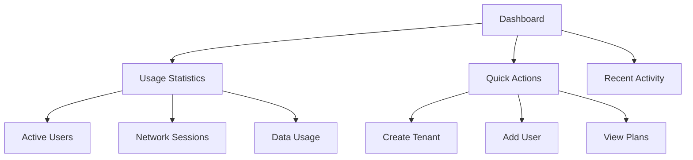
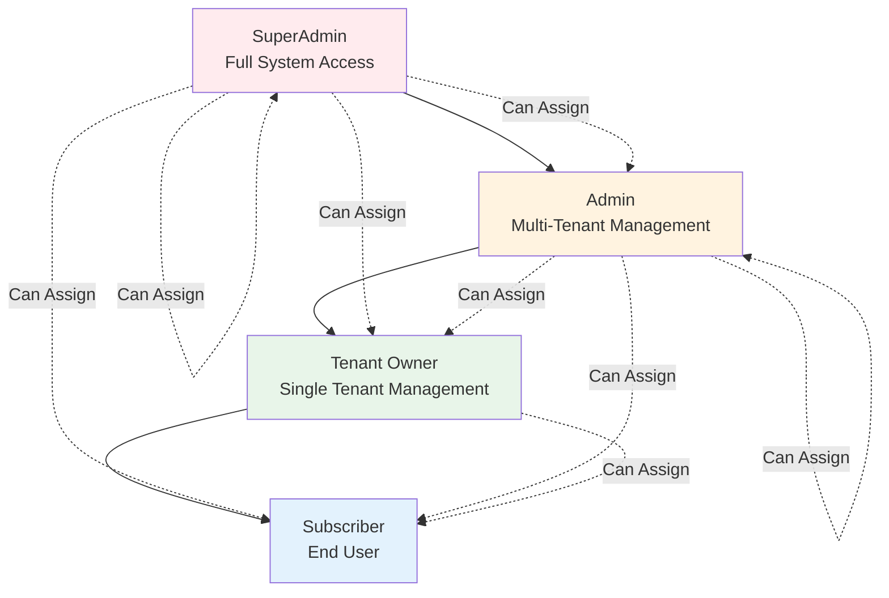
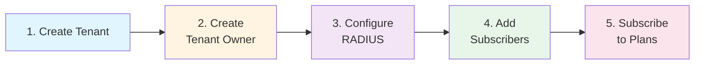

# Quick Start Guide

This guide will walk you through your first steps with WiWebb. By the end, you'll understand how to navigate the interface, create organizations, manage users, and explore the key features.

!!! info "Prerequisites"
    Before proceeding, ensure you have [installed WiWebb](installation.md) and can access the web interface at [http://localhost:5173](http://localhost:5173).

## Your First Login

### 1. Access the Login Page

Navigate to the WiWebb frontend:

```
http://localhost:5173
```

You'll be greeted with the login screen.

### 2. Enter Your Credentials

Use the superuser credentials you created during installation:

- **Username:** `admin` (or your custom username)
- **Password:** (from `.env.local` or what you set during setup)

!!! tip "Forgot Password?"
    If you forgot your password, you can reset it using Django management commands:

    ```bash
    docker compose exec django python manage.py changepassword admin
    ```

### 3. Explore the Dashboard

After logging in, you'll land on the main dashboard. Here's what you'll see:



## Creating Your First Tenant

Tenants (organizations) are the foundation of WiWebb's multi-tenant architecture. Each tenant represents an isolated organization with its own users and resources.

### Step 1: Navigate to Tenants

From the sidebar, click **Organizations** → **Tenants**.

### Step 2: Create a New Tenant

Click the **"Create Tenant"** button.

Fill in the tenant details:

```yaml
Name: ACME Corporation
Slug: acme-corp  # (1)!
Email: admin@acme.com
Description: Example organization for ACME Corp
```

1. The slug is used in URLs and must be unique. It can only contain lowercase letters, numbers, and hyphens.

!!! example "Tenant Creation via API"
    You can also create tenants programmatically:

    === "cURL"
        ```bash
        curl -X POST http://localhost:8000/api/v1/tenants/ \
          -H "Authorization: Token your-auth-token" \
          -H "Content-Type: application/json" \
          -d '{
            "name": "ACME Corporation",
            "slug": "acme-corp",
            "email": "admin@acme.com",
            "description": "Example organization"
          }'
        ```

    === "Python"
        ```python
        import requests

        headers = {
            'Authorization': 'Token your-auth-token',
            'Content-Type': 'application/json'
        }

        data = {
            'name': 'ACME Corporation',
            'slug': 'acme-corp',
            'email': 'admin@acme.com',
            'description': 'Example organization'
        }

        response = requests.post(
            'http://localhost:8000/api/v1/tenants/',
            headers=headers,
            json=data
        )
        print(response.json())
        ```

    === "JavaScript"
        ```javascript
        const response = await fetch('http://localhost:8000/api/v1/tenants/', {
          method: 'POST',
          headers: {
            'Authorization': 'Token your-auth-token',
            'Content-Type': 'application/json'
          },
          body: JSON.stringify({
            name: 'ACME Corporation',
            slug: 'acme-corp',
            email: 'admin@acme.com',
            description: 'Example organization'
          })
        });
        const tenant = await response.json();
        console.log(tenant);
        ```

Click **"Create"** to save the tenant.

## Adding Users to a Tenant

Now that you have a tenant, let's add users to it.

### Step 1: Navigate to Users

From the sidebar, click **Organizations** → **Users**.

### Step 2: Create a New User

Click **"Add User"** and fill in the details:

```yaml
Username: john.doe
Email: john.doe@acme.com
First Name: John
Last Name: Doe
Tenant: ACME Corporation  # (1)!
Role: Subscriber  # (2)!
Password: SecurePassword123!
```

1. Select the tenant you just created
2. Available roles: SuperAdmin, Admin, Tenant Owner, Subscriber

!!! info "User Roles Explained"
    - **SuperAdmin**: Full system access, can manage all tenants
    - **Admin**: Can manage all tenants but cannot assign SuperAdmin role
    - **Tenant Owner**: Can manage their own tenant and its users
    - **Subscriber**: Regular user with limited permissions

### Understanding Role Hierarchy



## Exploring Subscription Plans

WiWebb supports subscription-based billing with different plan tiers.

### View Available Plans

Navigate to **Billing** → **Plans** to see available subscription plans.

### Plan Features

Each plan includes:

- **Daily time limit**: Maximum connection time per day (in minutes)
- **Daily data limit**: Maximum data transfer per day (in MB)
- **Pricing**: Monthly, yearly, or custom pricing intervals
- **Trial period**: Optional trial period in days

!!! example "Example Plans"
    | Plan | Daily Time | Daily Data | Price |
    |------|------------|------------|-------|
    | Basic | 240 min (4h) | 512 MB | $9.99/month |
    | Professional | 480 min (8h) | 2048 MB (2 GB) | $19.99/month |
    | Enterprise | Unlimited | Unlimited | $49.99/month |

### Subscribe a User to a Plan

To subscribe a user:

1. Navigate to **Billing** → **Subscriptions**
2. Click **"Subscribe User"**
3. Select the user and plan
4. Complete the payment flow

!!! warning "Stripe Setup Required"
    For production subscriptions, you need to configure Stripe API keys.
    See the [Configuration Guide](configuration.md#stripe-integration) for details.

## Exploring Network Features

### RADIUS Server

WiWebb includes a built-in RADIUS server for network authentication.

**Navigate to:** Network → RADIUS

Here you can:

- View active sessions
- Configure NAS devices
- Monitor accounting logs
- Manage user groups

### VPN Management

**Navigate to:** Network → VPN

Configure VPN services:

- **Client VPN**: Individual user VPN access
- **Site-to-Site VPN**: Connect remote locations

### Hotspot Monitoring

**Navigate to:** Network → Hotspots

Monitor and manage public WiFi hotspots:

- View connected users
- Track bandwidth usage
- Generate reports

## IP Address Management (IPAM)

### Create a Subnet

1. Navigate to **Network** → **IP Management** → **Subnets**
2. Click **"Add Subnet"**
3. Enter subnet details:

```yaml
Network: 192.168.1.0/24
Name: Main Office Network
Description: Primary office subnet
```

### Allocate IP Addresses

Once you have subnets, you can allocate specific IP addresses:

1. Navigate to **IP Management** → **IP Addresses**
2. Click **"Allocate IP"**
3. Select a subnet and enter details

## Certificate Management

### Create a Certificate Authority

1. Navigate to **Certificates** → **Authorities**
2. Click **"Create CA"**
3. Enter CA details and generate

### Issue Certificates

With a CA created, you can issue certificates for secure communications:

1. Navigate to **Certificates** → **Certificates**
2. Click **"Issue Certificate"**
3. Select the CA and enter certificate details

## Getting Your API Token

To use the WiWebb API programmatically, you need an authentication token.

### Option 1: Via Web Interface

1. Click your username in the top-right corner
2. Select **"Profile"**
3. Copy your API token

### Option 2: Via API Login

```bash
curl -X POST http://localhost:8000/api/v1/auth/login/ \
  -H "Content-Type: application/json" \
  -d '{"username":"admin","password":"your-password"}'
```

Response:
```json
{
  "key": "abc123def456..."
}
```

Save this token for API requests:

```bash
# Set as environment variable
export WIWEBB_TOKEN="abc123def456..."

# Use in requests
curl -H "Authorization: Token $WIWEBB_TOKEN" \
  http://localhost:8000/api/v1/auth/user/
```

## Navigating the Interface

### Sidebar Navigation

The sidebar is organized into logical sections:

```
📊 Dashboard
│
├── 🏢 Organizations
│   ├── Tenants
│   ├── Users
│   └── Roles & Permissions
│
├── 🌐 Network
│   ├── RADIUS
│   ├── VPN
│   ├── Hotspots
│   └── Monitoring
│
├── 🔢 IP Management
│   ├── Subnets
│   └── IP Addresses
│
├── 🔐 Certificates
│   ├── Authorities
│   └── Certificates
│
├── 💳 Billing
│   ├── Plans
│   ├── Subscriptions
│   └── Payments
│
└── ⚙️ Settings
    ├── Profile
    └── Preferences
```

### Keyboard Shortcuts

!!! tip "Pro Tips"
    - **Ctrl/Cmd + K**: Global search
    - **Ctrl/Cmd + /**: Toggle sidebar
    - **Esc**: Close modals
    - **Tab**: Navigate form fields

## Common First Tasks

Here's a typical workflow for getting started with a new WiWebb installation:



### 1. Create Tenant
Set up an organization for a client or department.

### 2. Create Tenant Owner
Add a user with Tenant Owner role to manage the organization.

### 3. Configure RADIUS
Set up RADIUS authentication for network access.

### 4. Add Subscribers
Create end-user accounts for network access.

### 5. Subscribe to Plans
Assign subscription plans for billing and usage limits.

## What's Next?

Now that you're familiar with the basics, explore these topics:

!!! example "Continue Learning"
    - **[Configuration Guide](configuration.md)** - Configure WiWebb for production
    - **[User Guide](../user-guide/organizations/tenants.md)** - Detailed feature documentation
    - **[API Reference](../api-reference/authentication.md)** - Integrate with your applications
    - **[Architecture](../architecture/overview.md)** - Understand how WiWebb works

## Tips for Success

!!! tip "Best Practices"
    1. **Organize by Tenant**: Keep related resources within the same tenant
    2. **Use Descriptive Names**: Make slugs and names meaningful
    3. **Assign Proper Roles**: Don't give users more permissions than needed
    4. **Monitor Usage**: Regularly check network monitoring and reports
    5. **Backup Regularly**: Set up automated database backups

!!! warning "Security Reminders"
    - Change default passwords immediately
    - Use strong, unique passwords for each user
    - Enable two-factor authentication when available
    - Regularly review user permissions
    - Keep WiWebb updated to the latest version

---

**Congratulations!** You've completed the quick start guide. You now know how to navigate WiWebb, create tenants, manage users, and explore the core features.

!!! question "Need More Help?"
    - [Configuration Guide](configuration.md) - Advanced settings
    - [Troubleshooting](../troubleshooting/common-issues.md) - Common issues
    - [FAQ](../troubleshooting/faq.md) - Frequently asked questions
