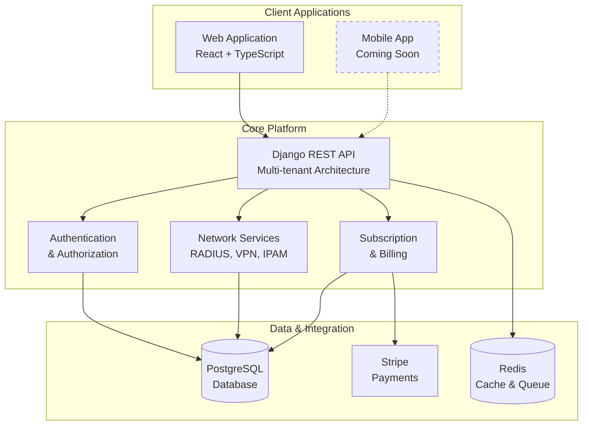

# WiWebb Documentation

Welcome to the comprehensive documentation for **WiWebb** - a full-stack multi-tenant network management platform designed for modern ISPs, enterprises, and network operators.

## What is WiWebb?

WiWebb is an integrated network management solution that combines powerful backend APIs with intuitive frontend interfaces to manage your entire network infrastructure. From RADIUS authentication to VPN management, from IP address allocation to subscription billing, WiWebb provides everything you need to run a professional network service.

## Key Features

### Multi-Tenant Architecture
- **Organization Management**: Isolate data and users across multiple tenants
- **Role-Based Access Control**: SuperAdmin, Admin, Tenant Owner, and Subscriber roles
- **Tenant-Scoped Resources**: Automatic data isolation and access control

### Network Services
- **RADIUS AAA**: Authentication, Authorization, and Accounting for network access
- **VPN Management**: Client VPN and Site-to-Site VPN configuration
- **Hotspot Management**: Manage and monitor public WiFi hotspots
- **Real-time Monitoring**: Track active sessions, usage, and network health

### IP Address Management (IPAM)
- **Subnet Planning**: Organize and allocate IP subnets
- **IP Tracking**: Manage IP address assignments and availability
- **Network Organization**: Logical grouping of network resources

### Certificate Management
- **Certificate Authorities**: Manage internal CAs for secure communications
- **Certificate Lifecycle**: Issue, renew, and revoke certificates
- **Secure Communications**: Enable encryption across your network

### Subscription & Billing
- **Flexible Plans**: Multiple subscription tiers with different features
- **Stripe Integration**: Secure payment processing
- **Usage Limits**: Daily time and data quotas per plan
- **Trial Periods**: Support for trial subscriptions

### Developer-Friendly APIs
- **RESTful APIs**: Well-documented REST endpoints
- **Token Authentication**: Secure API access with tokens
- **Comprehensive SDKs**: Easy integration with Python, JavaScript, and more

## Technology Stack

### Backend
- **Django 5.2.3**: Modern Python web framework
- **Django REST Framework**: Powerful API development
- **PostgreSQL**: Robust relational database
- **Redis**: Caching and async task queue
- **Celery**: Distributed task processing
- **Stripe**: Payment gateway integration

### Frontend
- **React 19**: Latest React with concurrent features
- **TypeScript**: Type-safe development
- **Vite**: Lightning-fast build tool
- **TanStack Query**: Efficient data fetching and caching
- **shadcn/ui**: Beautiful, accessible components
- **Tailwind CSS**: Utility-first styling

### Deployment
- **Docker**: Containerized deployment
- **Docker Compose**: Multi-container orchestration
- **LocalStripe**: Development payment testing

## Quick Links

-   :material-rocket-launch:{ .lg .middle } **Getting Started**

    ---

    Install WiWebb and start managing your network in minutes

    [:octicons-arrow-right-24: Installation Guide](getting-started/installation.md)

-   :material-book-open-variant:{ .lg .middle } **User Guide**

    ---

    Learn how to use WiWebb's features and manage your network

    [:octicons-arrow-right-24: User Guide](user-guide/organizations/tenants.md)

-   :material-code-braces:{ .lg .middle } **API Reference**

    ---

    Integrate WiWebb with your applications using our APIs

    [:octicons-arrow-right-24: API Docs](api-reference/authentication.md)

-   :material-cog:{ .lg .middle } **Architecture**

    ---

    Understand the system design and technical architecture

    [:octicons-arrow-right-24: Architecture](architecture/overview.md)

## Use Cases

### Internet Service Providers (ISPs)
- Manage subscriber authentication with RADIUS
- Control access to network resources
- Track usage and billing
- Provide VPN services to customers

### Enterprise Networks
- Centralized user management
- Secure remote access via VPN
- Certificate-based authentication
- Network resource tracking

### Hotspot Operators
- Manage public WiFi locations
- Monitor user sessions
- Control bandwidth and access times
- Generate usage reports

### Managed Service Providers (MSPs)
- Multi-tenant customer management
- Isolated environments per client
- White-label capabilities
- Comprehensive reporting

## Community & Support

!!! info "Need Help?"
    - Check our [Troubleshooting Guide](troubleshooting/common-issues.md) for common issues
    - Review the [FAQ](troubleshooting/faq.md) for frequently asked questions
    - Contact support at support@thinesoft.com

!!! tip "Contributing"
    WiWebb is actively developed. If you'd like to contribute, check out our [Contributing Guide](development/contributing.md)

## License & Credits

WiWebb is developed by [Thinesoft](https://thinesoft.com) and licensed under proprietary terms.

---

**Ready to get started?** Head over to the [Installation Guide](getting-started/installation.md) to set up WiWebb!
